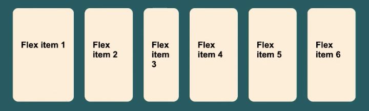

## CSS Flex Items

### Order
`order` - flex container ichida flex items odatiy oqimga `flow` ko'ra joylashadi ya'ni html kodda birinchi yozilgan flex item web sahifada ham birinchi keladi lekin `order` xossasi bu oqimni o'zgartirishi mumkin va flex items ketma ketligini belgilab beradi.


## Flex grow
`flex-grow` - flex item ni kerak payti o'z o'lchovini qanday oshirishini belgilab beradi. U son ko'rinishidagi qiymat qabul qilib, bo'sh qolgan joyni qancha qismini egallashni ko'rsatib beradi. Defaylt qiymat 0 hisoblanadi

```css
.flex-grow-1 {
	flex-grow: 1;
}
```


```css
.flex-grow-2 {
	flex-grow: 2;
}
```


## Flex grow
`flex-shrink` - flex item ni kerak payti o'z o'lchovini qanday kichraytirishini belgilab beradi. U son ko'rinishidagi qiymat qabul qilib, joy qolmagan payti element qanday suratda kichrayishini belgilab beradi. Defual qiymat 1 hisoblanadi

```css
.flex-shrink-0 {
	flex-shrink: 0;
}
.flex-shrink-2 {
	flex-shrink: 2;
}
```



## Flex basis
flex basis - flex item uchun boshlang'ich o'lchovini belgilab beradi


