## CSS Grid

CSS Grid (to'r)ga asoslangan Layout moduli satrlar va ustunlar bilan gridga asoslangan tartib tizimini taklif etadi, bu esa float va joylashishni aniqlashdan foydalanmasdan veb-sahifalarni loyihalashni osonlashtiradi. CSS grid 2 asosiy elementdan tashkil topgan, `grid container` va `grid item`  

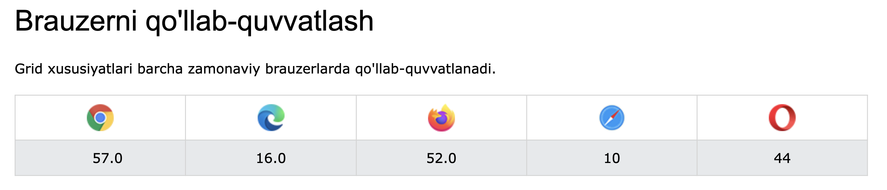

### Grid container
Css grid display hosasi uchun grid yoki inline-grid qiymatiga ega bo'lgan elementga aytiladi

grid – blok darajasidagi panjara hosil qiladi
inline-grid - inline darajadagi panjara hosil qiladi

```css
.grid-container {
  display: grid | inline-grid;
}
```

### Grid Columns (Grid ustunlari)
Grid elementining vertical chiziqlari `column(ustunlar)` deb ataladi

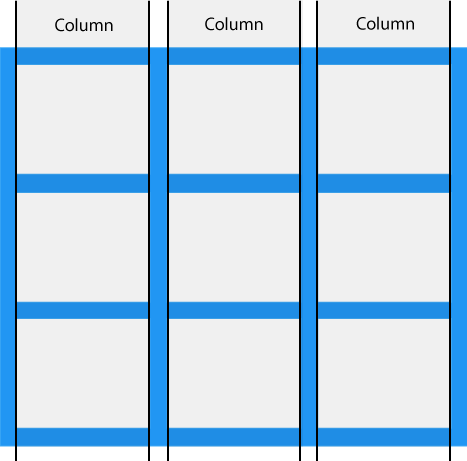

### Grid Columns (Grid qatorlari)

Grid elementlarining gorizontal chiziqlari `rows(qatorlar)` deb ataladi .

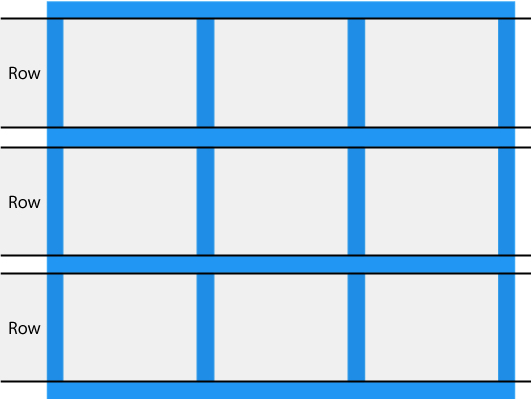

### Grid Gaps (Grid bo'shliqlari)

Har bir **ustun/qator** orasidagi bo'shliqlar `gap` deb ataladi.

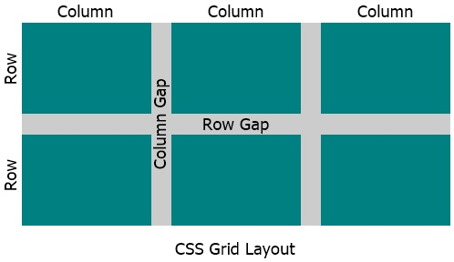

#### 


::: tip Quyidagi xususiyatlardan biri yordamida gap(bo'shliq) hajmini sozlashingiz mumkin:
1. Katta harfda class yozmang
2. Raqamlarda yozmang class
3. 2ta so'zdan foydalansanggiz orasiga _ - bunday chiziqchalar qo'ying
4. Contentdan kelib chiqib class berish harakat qiling
:::

::: tip Misol
Property (Xususiyat) `column-gap` ustunlar orasidagi bo'shliqni belgilaydi:
```css
.grid-container {
  display: grid;
  column-gap: 50px;
}
```
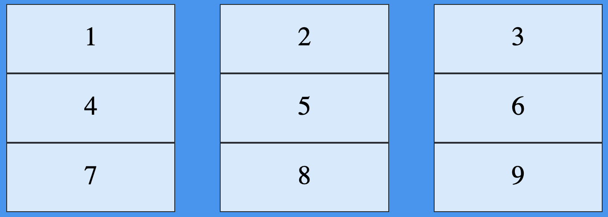
:::

::: tip Misol
Property (Xususiyat) `row-gap` qatorlar orasidagi bo'shliqni o'rnatadi
```css
.grid-container {
  display: grid;
  row-gap: 50px;
}
```
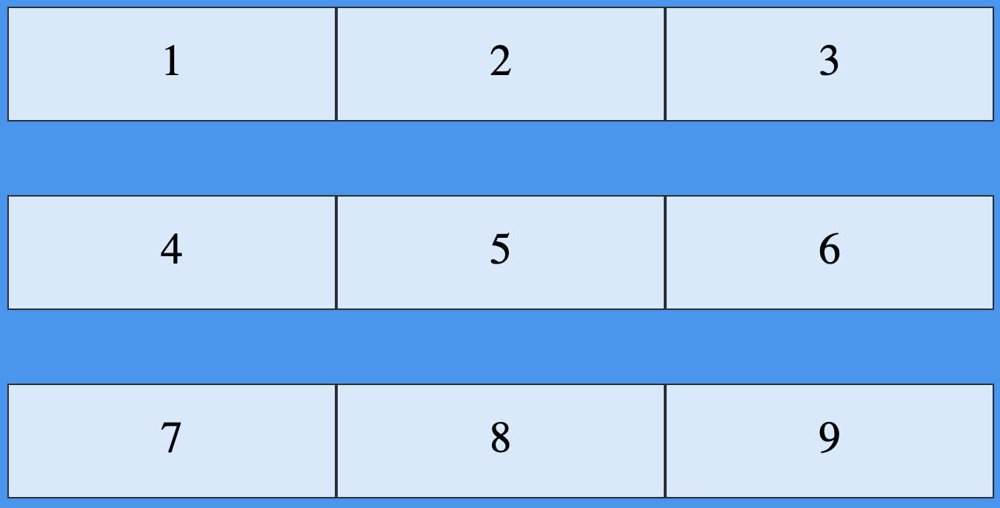
:::

::: tip Misol
Property Mulk va xususiyatlarning `gap` qisqartmasi hisoblanadi :`row-gap` `column-gap`
```css
 .grid-container {
  display: grid;
  gap: 50px 100px;
}
```
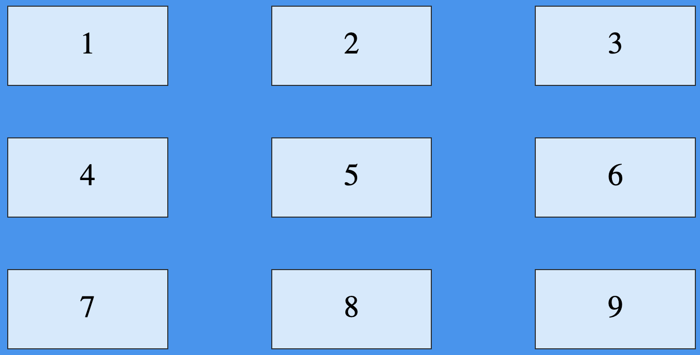
:::

### Grid Lines(chiziqlar)

Ustunlar orasidagi chiziqlar `column(ustun)` lines(chiziqlari) .

Qatorlar orasidagi chiziqlar `row(qator)` lines(chiziqlari) .

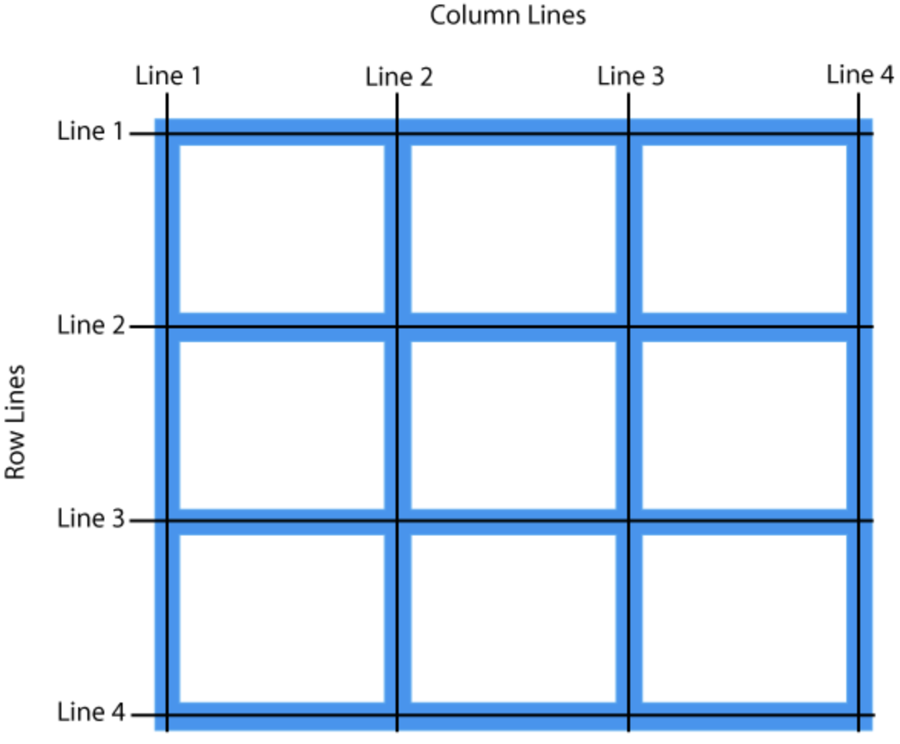

::: tip Keling bir misol ko'armiz.
Bizda 8ta item mavjud bizni containerimizni joyi esa 9ta elementga yetadi biz 8ta elementdan 1tasini hajmini oshirib ortib qolayotkan joyni to'ldirishimiz mumkun

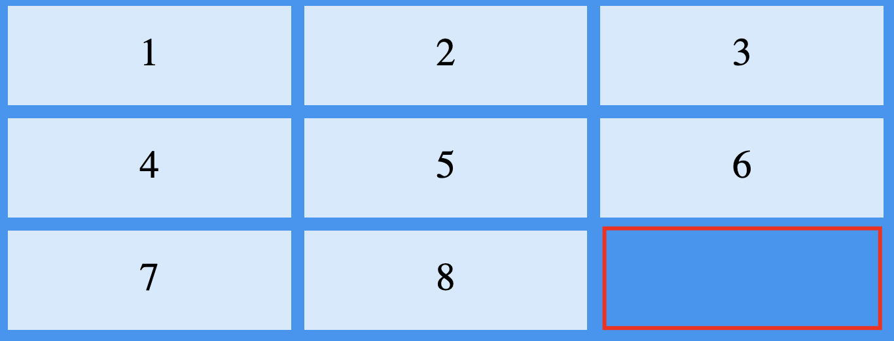

```html
<div class="grid-container">
  <div class="item1">1</div>
  <div class="item2">2</div>
  <div class="item3">3</div>  
  <div class="item4">4</div>
  <div class="item5">5</div>
  <div class="item6">6</div>
  <div class="item7">7</div>
  <div class="item8">8</div>  
</div>
```

```css
.grid-container {
  display: grid;
  grid-template-columns: auto auto auto;
  gap: 10px;
  background-color: #2196F3;
  padding: 10px;
}

.grid-container > div {
  background-color: rgba(255, 255, 255, 0.8);
  text-align: center;
  padding: 20px 0;
  font-size: 30px;
}

.item1 {
  grid-column-start: 1;
  grid-column-end: 3;
}
```
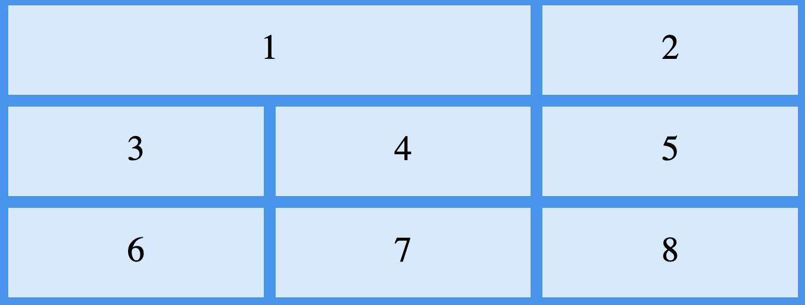
:::

::: tip Keling endi shu misolni qatorlar bilan sinab ko'armiz.
<br>


```html
<div class="grid-container">
  <div class="item1">1</div>
  <div class="item2">2</div>
  <div class="item3">3</div>  
  <div class="item4">4</div>
  <div class="item5">5</div>
  <div class="item6">6</div>
  <div class="item7">7</div>
  <div class="item8">8</div>  
</div>
```

```css
.grid-container {
  display: grid;
  grid-template-columns: auto auto auto;
  gap: 10px;
  background-color: #2196F3;
  padding: 10px;
}

.grid-container > div {
  background-color: rgba(255, 255, 255, 0.8);
  text-align: center;
  padding: 20px 0;
  font-size: 30px;
}

.item1 {
  grid-row-start: 1;
  grid-row-end: 3;
}
```
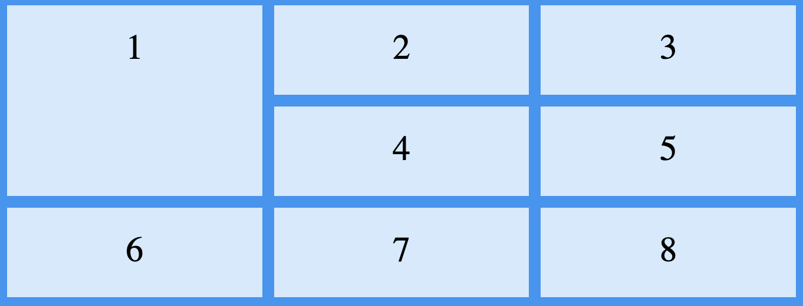
:::


## Grid container

Grid containerning ikki asosiy hosasi mavjud: `grid-template-columns`, `grid-template-rows` 
#### Grid template columns
Grid template columns - container ichidagi ustunlar sonini va uzunligini belgilashda ishlatilinadi

::: tip Misol

```html
<div class="grid-container">
  <div class="item1">1</div>
  <div class="item2">2</div>
  <div class="item3">3</div>  
  <div class="item4">4</div>
  <div class="item5">5</div>
  <div class="item6">6</div>
</div>
```

```css
.grid-container {
  display: grid;
  grid-template-columns: auto auto auto;
  gap: 10px;
  background-color: #2196F3;
  padding: 10px;
}

.grid-container > div {
  background-color: rgba(255, 255, 255, 0.8);
  text-align: center;
  padding: 20px 0;
  font-size: 30px;
}

.item1 {
  grid-row-start: 1;
  grid-row-end: 3;
}
```
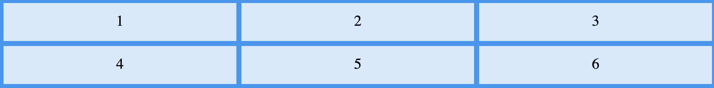

```html
<div class="grid-container">
  <div class="item1">1</div>
  <div class="item2">2</div>
  <div class="item3">3</div>  
  <div class="item4">4</div>
  <div class="item5">5</div>
  <div class="item6">6</div>
</div>
```

```css
.grid-container {
  display: grid;
  grid-template-columns: auto 300px;
  gap: 10px;
  background-color: #2196F3;
  padding: 10px;
}

.grid-container > div {
  background-color: rgba(255, 255, 255, 0.8);
  text-align: center;
  padding: 20px 0;
  font-size: 30px;
}

.item1 {
  grid-row-start: 1;
  grid-row-end: 3;
}
```


:::

#### Grid rows

Xususiyat grid-template-rowshar bir qatorning balandligini belgilaydi.

```css
.grid-container {
  display: grid;
  grid-template-rows: 80px 200px;
}
```
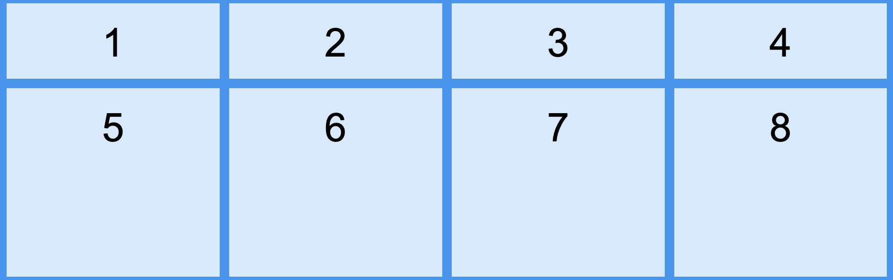

<!--  -->