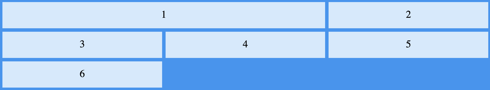
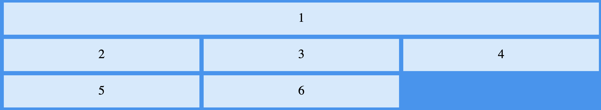
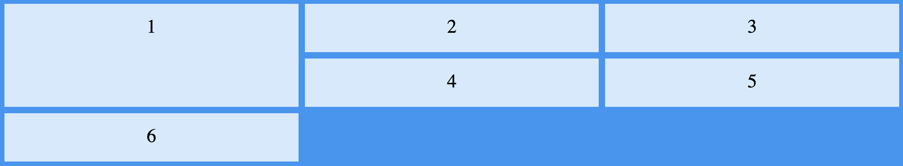
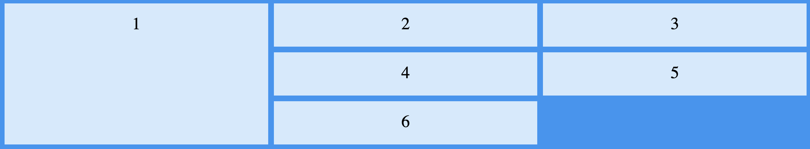

## Grid item

### Grid column

Grid itemga tegishli xosalar yordamida bir necha ustun va qatorni egalashini o'tishimiz mumkun. Uning asosiy ikki hosasi mavjud `grid-column` va `grid row`

```html
<div class="grid-container">
  <div class="grid-item item1">1</div>
  <div class="grid-item">2</div>
  <div class="grid-item">3</div>
  <div class="grid-item">4</div>
  <div class="grid-item">5</div>
  <div class="grid-item">6</div>
</div>
```

```css
.grid-container {
  display: grid;
  grid-template-columns: auto auto auto;
  gap: 10px;
  background-color: #2196f3;
  padding: 10px;
}

.grid-container > div {
  background-color: rgba(255, 255, 255, 0.8);
  text-align: center;
  padding: 20px 0;
  font-size: 30px;
}

.item1 {
  grid-column: 1 / 3;
}
/* 1 / 3 --> birinchi ustundan boshlab 3-usutungacha joyni olgin degani */
```



```css
.item1 {
  grid-column: 1 / span 3;
}
/* span kalit so'zi nechanchi ustungacha olishini emas nechta ustuni olishini ko'rsatish uchun ishlatilinadi! */
```



### Grid row

Grid row element nechta qatorni o'z ichiga olishini belgilab beradi

```css
.item1 {
  grid-column: 1 / 3;
}
```



```css
.item1 {
  grid-column: 1 / span 3;
}
```



### Grid area

grid-row-start, grid-column-start, grid-row-end, grid-column-end

### fr

CSS Grid’da "1fr" bu “fractional unit” (bo’lak birligi) degan ma’noni anglatadi. U grid bo’ylab bo’linadigan bo’lakni ifodalaydi. Yani, mavjud bo’lgan bo’sh joyni teng bo’laklarga bo’lish uchun ishlatiladi.

### Grid media

```cs
.grid-container {
  display: grid;
  grid-template-columns: repeat(auto-fit, minmax(200px, 1fr));
  gap: 20px;
}
```

Bu misolda grid-template-columns stil xususiyati repeat(auto-fit, minmax(200px, 1fr)) bilan belgilangan. Bu quyidagicha ishlaydi:
`repeat(auto-fit, ...)` ifoda, setkalar sonini avtomatik ravishda belgilaydi. Brauzer oynasining yoki konteynerning eni bo'yicha setkalarini to'ldiradi yoki setkalarni avtomatik tarzda sozlaydi.

`minmax(200px, 1fr)` ifoda, har bir sotkaning minimal enining 200 piksel, maksimal enining esa mavjud bo'sh joyni teng va teng taqsimlab qo'yilgan barcha bo'sh joyni to'ldirishini ifodalaydi. Bu sotkalarni dinamik tarzda kattalashtirish va kichraytirish imkoniyatini beradi.

Natijada, ushbu misol, setkalarning brauzer oynasining yoki konteynerning eni boyicha avtomatik tarzda belgilangan gridni yaratadi. Agar brauzer oynasi kattasa, qo'shimcha setkalar qo'shila oladi va setkalar kamida 200 piksel bo'ladi. Agar brauzer oynasi qisqarsa, setkalar avtomatik tarzda kichraydi. gap xususiyati setkalar va qatorlar orasidagi bo'shlikni belgilaydi.

## Grid area

grid-area yordamida siz grid ichidagi elementni bir vaqtning o’zida bir nechta qator va ustun bo’ylab joylashtira olasiz.

Grid area 4ta raqamni qabul qiladi

```css
grid-area: row-start / column-start / row-end / column-end;
```
