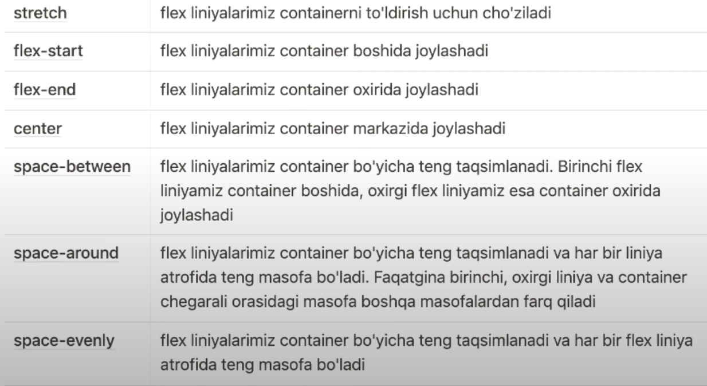

##  CSS flex box

foydali havola <a href="https://css-tricks.com/snippets/css/a-guide-to-flexbox/" target="_blank">Flex</a>

## CSS Flex box Layout moduli
float yoki position holasalari yordamisiz web sahifada moslashuvchan `(flexible)` layout yaratishda yordam beradi. Odiy aytganda web sahifadagi elementlarni joylashishi uchun hizmat qiladi. Flex box 2 asosiy elementlardan tashkil topgan: `flex container` va `flex items`

### Flex container
`Flex container` display xosasi uchun flex qiymatiga ega bo'lgan elementlarga aytiladi. <br>
Ko'k bo'lim bu `flex container` hisoblanadi uning ichidagi elementlar esa `flex items` hisoblanadi


### salom

::: tip Moslashuvchan konteyner xususiyatlari
1. flex-direction
2. flex-wrap
3. flex-flow
4. justify-content
5. align-items
6. align-content
:::


### 1. Flex-direction Property(hususiyati)
`Flex-direction container` elementlarni qaysi yo'nalishda to'plashni belgilaydi.

#### Misol:
```css
.flex-container {
  display: flex;
  flex-direction: column;
}
```
### 2. Qiymat `column-reverse` moslashuvchan elementlarni vertikal ravishda yig'adi (lekin pastdan yuqoriga):

```css
.flex-container {
  display: flex;
  flex-direction: column-reverse;
}
```


### 3. Qiymat `row` moslashuvchan elementlarni gorizontal ravishda yig'adi (chapdan o'ngga):

```css
.flex-container {
  display: flex;
  flex-direction: row;
}
```


### 4. Qiymat `row-reverse` moslashuvchan elementlarni gorizontal ravishda yig'adi (lekin o'ngdan chapga):

```css
.flex-container {
  display: flex;
  flex-direction: row-reverse;
}
```


### 5. Flex-wrap xususiyati

Xususiyat `flex-wrap` egiluvchan elementlarning agarda containerga sig'masa pastga tushishi yoki tushmasligini belgilaydi.

Quyidagi misollarda flex-wrap xususiyatni yaxshiroq namoyish qilish uchun 12 ta moslashuvchan element mavjud.


```css
.flex-container {
  display: flex;
  flex-wrap: wrap;
}
```


### 6. Qiymat `nowrap` moslashuvchan elementlarning o'ralmasligini bildiradi (bu standart qiymat hisoblanadi) default:

```css
.flex-container {
  display: flex;
  flex-wrap: nowrap;
}
```


### 7. Qiymat `nowrap` moslashuvchan elementlarning o'ralmasligini bildiradi (bu standart qiymat hisoblanadi) default:

```css
.flex-container {
  display: flex;
  flex-wrap: wrap-reverse;
}
```


### 8. Flex-flow

`flex-flow` - bu CSS-dagi stenografiya xususiyati bo'lib, u `flex-direction` va `flex-wrap` xossalari uchun qisqartma hisoblanadi

```css
.flex-container {
  display: flex;
  flex-flow: row wrap;
}
```

### 10. Justify-content

`justify-content` - asosiy o'qi bo'ylab elementlarni joylashuvini belgilaydi va qo'shimcha bo'sh joyni taqsimlashga yordam beradi

::: tip Justify-content
1. flex-start: elementlarimiz flex container boshida joylashadi
2. flex-end: elementlarimiz flex container oxirida joylashadi
3. center: elementlarimiz flex container marjazida joylashadi
4. space-between: elementlarimiz flex container bo'yicha teng taqsimlanadi. Birinchi elementlarimiz container boshida, oxirgi elemtimiz esa container oxirida joylashadi
5. space-around: asosiy o'qdagi egiluvchan elementlar atrofida bo'sh joy qanday taqsimlanishini aniqlaydi va elementlar o'rtasida va atrofida teng bo'sh joy yaratadi.
6. space-evenly: U asosiy o'q bo'ylab moslashuvchan elementlar o'rtasida va atrofida bo'sh joyni teng ravishda taqsimlaydi.
:::


### 10. Align items xususiyati

`align-items` moslashuvchan elementlarni tekislash uchun ishlatiladi. Yani Y o'qi bo'lab elementlarni joylashuvini belgilaydi

::: tip Align items
1. strech - elementlarimizn `flex container`ni to'ldirish uchun co'ziladi
2. center - elementlarimiz kesuvchi(Y) o'qning markazida joylashadi
3. flex-start - elementlarimiz kesuvchi(Y) o'qning boshida joylashadi
4. flex-end - elementlarimiz kesuvchi(Y) o'qning oxirida joylashadi
:::


### 10. Align content xususiyati

`align content` - kesuchi o'q (Y) bo'ylab flex container liniyalarini joylashuvini belgilaydi va qo'shimcha bo'sh joyni taqsimlashga yordam beradi


<br> <br>
