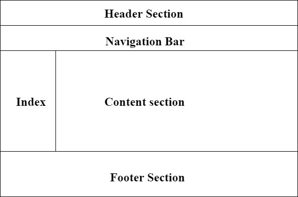

## 4-dars HTML layouts

HTML veb-sahifaning turli qismlarini belgilaydigan bir nechta semantik elementlarga ega:

:::  HTML
<!-- 1. ##<header>- Hujjat yoki bo'lim uchun sarlavhani belgilaydi -->
<!-- 2. <nav>- Navigatsiya havolalari to'plamini belgilaydi
3. <section>- Hujjatdagi bo'limni belgilaydi
4. <article>- Mustaqil, mustaqil tarkibni belgilaydi
5. <aside>- Tarkibdan tashqari tarkibni belgilaydi (yon panel kabi)
6. <footer>- Hujjat yoki bo'lim uchun pastki ko'rsatkichni belgilaydi
7. 
- Foydalanuvchi talabiga binoan ochishi va yopishi mumkin bo'lgan qo'shimcha tafsilotlarni belgilaydi
8. 

- Element uchun sarlavhani belgilaydi -->
HTML maxsus ma'noga ega bo'lgan matnni aniqlash uchun bir nechta elementlarni o'z ichiga oladi.
::: tip Formatlash elementlari
1. `<header>`- Hujjat yoki bo'lim uchun sarlavhani belgilaydi
2. `<nav>`-Navigatsiya havolalari to'plamini belgilaydi
3. `<section>`-  Hujjatdagi bo'limni belgilaydi
4. `<article>`- Mustaqil, mustaqil tarkibni belgilaydi
5. `<aside>`- Tarkibdan tashqari tarkibni belgilaydi (yon panel kabi)
6. `<footer>`- Hujjat yoki bo'lim uchun pastki ko'rsatkichni belgilaydi
7. `
`- Foydalanuvchi talabiga binoan ochishi va yopishi mumkin bo'lgan qo'shimcha tafsilotlarni belgilaydi
8. `

`- Element uchun sarlavhani belgilaydi --> <a href="https://www.w3schools.com/html/html5_semantic_elements.asp" target="_blank">Semantik elementlar haqida ko'proq shuyerda ko'piroq o'qishingiz mumkin</a> .
:::

## HTML Style Guide (HTML uslubi uchun qo'lanma)

