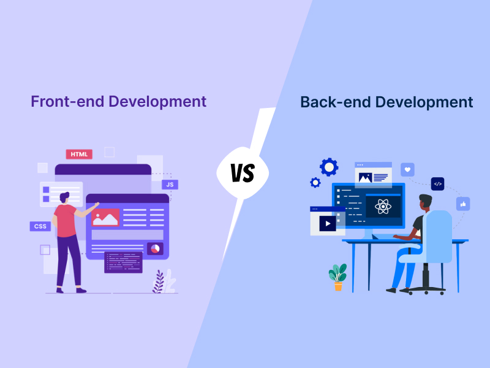
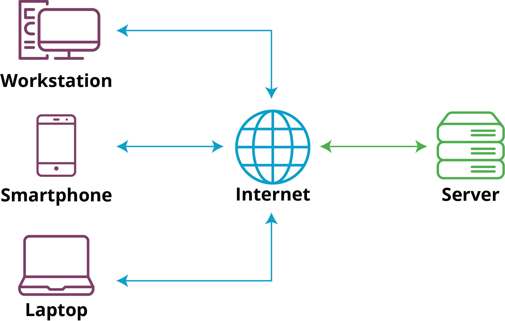

# Kirish

## Veb dasturlash
Veb dasturlash veb-saytlar, veb-loyihalar, veb-dasturlarni yaratishni o'z ichiga oladi va ikki qismga bo'linadi ular frontend dasturlash va backend dasturlash.

## Frontend

Frontend dasturlash, bir dastur interfeysini yaradish va iste'molchilarga etkazish uchun kerak bo'lgan qismini yaratish bilan bog'liq. Frontend, veb ilovalarni (veb-saytlar, veb-loyihalar, veb-dasturlar) va mobil ilovalarni o'z ichiga oladi.

Frontend dasturlash quyidagi texnologiyalardan foydalanadi:

HTML: Web sahifalar strukturasini yaratish uchun ishlatiladi. HTML elementlari orqali matnlar, rasmlar, video va boshqa mediyalarning tashqi ko'rinishini belgilaymiz.

CSS: HTML elementlarini stil berish uchun ishlatiladi. CSS yordamida ranglar, shakllar, shriftlar va tartiblar belgilanadi, sahifa dizayni tuziladi.

JavaScript: Veb-saytga interaktivlik qo'shish uchun ishlatiladi. JavaScript orqali matnlar, rasmlar, formalar bilan interaktyvlik yaratish, animatsiyalar, validatsiyalar va boshqa boshqaruv funksiyalarini qo'shish mumkin.

## Backend
Backend dasturlash, bir dasturning server tomoni va datalar bilan ishlashini ta'minlash bilan bog'liq. Backend, foydalanuvchidan kelgan so'rovni qabul qilib, uni ma'lumotlar bilan murojaat qilish, murojaatlarni qayta ishlash va natijalarni foydalanuvchiga qaytarishni o'z ichiga oladi.

Backend dasturlash quyidagi texnologiyalardan foydalanadi:

Server tomonidagi dasturlash tillari: Bu tillar orqali server logikasi va murojaatlar bajariladi. Ko'p mashhur backend dasturlash tillari quyidagilar bo'lishi mumkin:

Node.js: JavaScript tilidan foydalanuvchi, server tomonida dasturlashni amalga oshirishi mumkin.
Python: Oddiy va yuqori darajadagi dasturlarni yaratish uchun keng qo'llaniladigan dasturlash tili.
PHP: Ommalashtirilgan hypertext preprocessor, oddiy veb ilovalarni yaratish uchun keng qo'llaniladi.
Veb serverlar: Bu server dasturlarini ishga tushiruvchi server dasturlari, masalan, Apache, Nginx, IIS va boshqalar.

Ma'lumotlar bazalari: Backend dasturlashda ma'lumotlar bazalaridan ma'lumotlarni saqlash va ularga murojaat qilish uchun foydalaniladi. Masalan, MySQL, PostgreSQL, MongoDB, Redis, SQLite va hokazo.

API (Application Programming Interface): API'lar, backend va frontend o'rtasidagi murojaatlarni tashqaridan amalga oshirishga imkon beradi. Ular ma'lumotlarni qayta ishlash, depolash va talablar bilan aloqani ta'minlash uchun ishlatiladi.

## Veb saytlar qanday ishlaydi:
 

Veb saytlar server va client tomonidan ishlaydi. Foydalanuvchi frontend orqali serverga so’rov jo’natadi. Server esa so’rovlarni qabul qilib, so’rovlarga mos javobini frontendga qaytaradi.

## Client - Server modeli uch bosqichda ishlaydi.

1. Client, kompyuter yoki smartfon orqali internet tarmog'iga ulanadi.
2. Client serverga ma'lumotlar yuborish, olish yoki o'zgartirish uchun serverga turli so'rovlar yuboradi.
3. Server har bir mijoz so'rovini qayta ishlaydi va clientga so'rovga mos javob qaytaradi.

## Dasturlash muhiti

Dasturlash muhitiga kirish va kodelarimizni yozish uchun VS code dasturini kompyuterimizga o'rnatib olamiz

<a href="https://code.visualstudio.com/download" target="_blank">VS code dasturini ushbu saytdan yuklab oling</a>