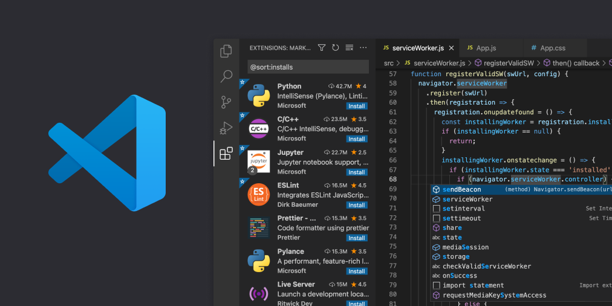

# 📔 1-dars

[[toc]]


## Kirish

JavaScript nima?
JavaScript dastlab "veb-sahifalarni jonli qilish" uchun yaratilgan.

Bu tildagi dasturlar skriptlar deb ataladi . Ular to'g'ridan-to'g'ri veb-sahifaning HTML-da yozilishi va sahifa yuklanganda avtomatik ravishda ishga tushishi mumkin.

Skriptlar oddiy matn sifatida taqdim etiladi va bajariladi. Ularni ishga tushirish uchun maxsus tayyorgarlik yoki kompilyatsiya kerak emas.

Bu jihatdan JavaScript Java deb nomlangan boshqa tildan juda farq qiladi .


### Javascript haqida
Javascript - web uchun maxsus yuqori darajadagi (high-level) dasturlash
tili. Uning yordamida HTML va CSS'ni dinamik darzda o'zgartirish
imkoniyati mavjud.
Hayotiy o'xshatish
    


- Web asoslarini kundalik ishlatatigan tilimizga o'xshatadigan bo'lsak,
HTML - ot (noun), CSS - sifat (adjective), Javascript esa fe'l (verb)
va'zifasini bajaradi


## Nima uchun u Java Script deb ataladi?

JavaScript yaratilganda, u dastlab boshqa nomga ega edi: "LiveScript". Ammo o'sha paytda Java juda mashhur edi, shuning uchun yangi tilni Java tilining "kenja ukasi" sifatida joylashtirish yordam berishiga qaror qilindi.

Ammo rivojlanish jarayonida JavaScript o'zining ECMAScript deb nomlangan spetsifikatsiyasiga ega bo'lgan to'liq mustaqil tilga aylandi va endi uning Java bilan umuman aloqasi yo'q.

Bugungi kunda JavaScript nafaqat brauzerda, balki serverda yoki aslida JavaScript dvigateli deb nomlangan maxsus dasturga ega bo'lgan har qanday qurilmada ham ishlashi mumkin .

Brauzerda ba'zan "JavaScript virtual mashinasi" deb ataladigan o'rnatilgan dvigatel mavjud.

Turli dvigatellarda turli xil "kod nomlari" mavjud. Masalan:

V8 - Chrome, Opera va Edge-da.
SpiderMonkey - Firefox-da.
…IE uchun “Chakra”, “JavaScriptCore”, “Nitro” va Safari uchun “SquirrelFish” kabi boshqa kod nomlari mavjud.
Yuqoridagi shartlarni eslab qolish yaxshidir, chunki ular Internetdagi ishlab chiquvchilar maqolalarida qo'llaniladi. Biz ham ulardan foydalanamiz. Misol uchun, agar "X xususiyati V8 tomonidan qo'llab-quvvatlansa", u ehtimol Chrome, Opera va Edge'da ishlaydi.

## Dvigatellar qanday ishlaydi?
## Dvigatellar murakkab. Lekin asoslar oson.

Dvigatel (agar u brauzer bo'lsa, o'rnatilgan) skriptni o'qiydi ("tahlillaydi").
Keyin u skriptni mashina kodiga o'zgartiradi ("kompilyatsiya qiladi").
Va keyin mashina kodi juda tez ishlaydi.
Dvigatel jarayonning har bir bosqichida optimallashtirishni qo'llaydi. U hatto tuzilgan skriptni ishlayotganini kuzatib boradi, u orqali o'tadigan ma'lumotlarni tahlil qiladi va shu bilimlar asosida mashina kodini yanada optimallashtiradi.

### Amaliyotda qo'llanilishi

1. Frontend development - Javascript yordamida veb sahifaga dinamik
ko'rinishda qo'shimchalar qo'shish, masalan matn va kontentni o'zgartirish,
rasmlarni o'lchovini o'zgartirish va h.k. Undan tashqari JS freymvorklar
yordamida veb sayt ishlab chiqish jarayonini ancha tez va oson amalga oshirish
imkoniyati mavjud

2. Backend development - JS'ga asoslangan NodeJS texnologiyasi orqali
backend ya'ni server-side dasturlashni amalga oshirish imkoniyati mavjud

3. Mobile application development - ReactNative va shunga o'xshash
texnologiyalar orqali Hybrid ko'rinishda mobil ilovalar yaratish imkoniyati mavjud

4. Game development - Online o'yinlar yaratishda Javascript ham faol tarzda
ishlatilinadi

### Javascript versiyalari - Javascript vs ECMAScript
Javascript - umumiy maqsadga yo'naltirilgan scripting til bo'lib,
ECMAScript tomonidan belgilangan spetsifikatsiyalarga javob beradi.
Boshqacha qilib aytganda, ECMAScript scripting til uchun reja (blueprint,
standard) bo'lsa, Javascript esa bu standard'ning amalga oshirilishidir.

## Bizga kerak bo'ladigan code editorlar
<br />

<br />


## O'zgaruvchilar


<a href="https://javascript.info/variables#a-variable" target="_blank">JavaScriptda o'zgaruvchilar haqida batafsil</a>

## Ma'lumot turlari

 Ma'lumotlar yoki qiymatlar ma'lumotlar turlariga ega. Ma'lumotlar turlari ma'lumotlarning xususiyatlarini tavsiflaydi. Ma'lumotlar turlarini ikkiga bo'lish mumkin:

1. Primitiv ma'lumotlar turlari
2. Non-Primitiv Oddiy bo'lmagan ma'lumotlar turlari (ob'ektga havolalar)

JavaScript-da sakkizta asosiy ma'lumotlar turi mavjud.

### Primitiv ma'lumotlar turlari

Primitiv ma'lumotlar turlari yagona qiymatlarni ifodalaydi va o'zgarmasdir, ya'ni ular yaratilgandan keyin ularning qiymatlarini o'zgartirib bo'lmaydi. Ular to'g'ridan-to'g'ri xotirada saqlanadi va siz o'zgaruvchiga yangi qiymat berganingizda, u ushbu qiymatning yangi nusxasini yaratadi.

JavaScript-dagi primitive ma'lumotlar turlariga quyidagilar kiradi:


Belgi: ES6 da kiritilgan belgilar noyob va oʻzgarmas qiymatlar boʻlib, koʻpincha obʼyekt mulki kalitlari sifatida ishlatiladi.

BigInt: ES11 da taqdim etilgan BigInt Raqam turi bilan ifodalanmaydigan juda katta butun sonlar uchun ishlatiladi.
 1. Number: Raqamli qiymatlarni ifodalaydi. Misollar: 5, 3.14, -10.
 2. String: Matnli ma'lumotlarni ifodalaydi. Misollar: "Salom, JavaScript!", "Bu string.".
 3. Boolean: to'g'ri yoki noto'g'ri qiymatlarni ifodalaydi. Misollar: rost(true), yolg'on(false).
 4. Undefined: e'lon qilingan, lekin qiymat berilmagan o'zgaruvchini ifodalaydi.
 5. Null: har qanday ob'ekt qiymatining ataylab yo'qligini ifodalaydi.

JavaScript-dagi Non-primitive(oddiy bo'lmagan) ma'lumotlar turlarini o'z ichiga oladi:

1. Ob'ektlar
2. Funksiyalar
3. Massivlar

Keling, Primitive va Non-Primitive ma'lumotlar turlari nimani anglatishini ko'rib chiqaylik. _Primitiv_ ma'lumotlar turlari o'zgarmas (o'zgartirilmaydigan) ma'lumotlar turlaridir. Bir Primitive ma'lumotlar turi yaratilgandan keyin biz uni o'zgartira olmaymiz.

**Privitive ma'lumot turlari**

```js
// String.
let str = "Hello";
let str2 = 'Single quotes are ok too';
// Ikki va bitta tirnoq "oddiy" tirnoqdir. JavaScript-da ular o'rtasida deyarli farq yo'q.
let num = 12;
let num2 = 12.2

// Mantiqiy tur yani Boolean. Boolean turi faqat ikkita qiymatga ega: true va false. Ushbu tur odatda ha/yo'q qiymatlarini saqlash uchun ishlatiladi: true"ha, to'g'ri" va false"yo'q, noto'g'ri" degan ma'noni anglatadi.
let s = true;
let x = false;

// Mantiqiy qiymatlar ham taqqoslash natijasida kelib chiqadi:
let isGreater = 4 > 1;

alert( isGreater ); // true


let 

```

**Misol:**

```js
let word = 'JavaScript'
```

Agar biz _word_ o'zgaruvchisida saqlangan satrni o'zgartirishga harakat qilsak, JavaScript xatoga yo'l qo'yishi kerak. Bitta qo'shtirnoq, qo'shtirnoq yoki teskari tirnoq ostidagi har qanday ma'lumotlar turi satr ma'lumotlar turidir.

```js
word[0] = 'Y'
```

Bu ifoda _word_ o'zgaruvchisida saqlangan qatorni o'zgartirmaydi. Shunday qilib, biz satrlarni o'zgartirib bo'lmaydigan yoki boshqacha qilib aytganda o'zgarmas deb aytishimiz mumkin. Primitiv ma'lumotlar turlari qiymatlari bo'yicha taqqoslanadi. Keling, turli xil ma'lumotlar qiymatlarini solishtiraylik.
Quyidagi misolga qarang:

```js
let numOne = 3
let numTwo = 3

console.log(numOne == numTwo)      // true

let js = 'JavaScript'
let py = 'Python'

console.log(js == py)             //false 

let lightOn = true
let lightOff = false

console.log(lightOn == lightOff) // false
```

### Non-Primitiv ma'lumotlar turlari

Primitiv bo'lmagan ma'lumotlar turlari o'zgartirilishi yoki o'zgarishi mumkin. Biz primitive bo'lmagan ma'lumotlar turlarining qiymatini yaratilgandan keyin o'zgartirishimiz mumkin. Keling, massiv yaratish orqali ko'raylik. Massiv - kvadrat qavs ichidagi ma'lumotlar qiymatlari ro'yxati.
Massivlar bir xil yoki turli xil ma'lumotlarni o'z ichiga olishi mumkin. Massiv qiymatlariga ularning indeksi orqali havola qilinadi. JavaScript-da massiv indeksi noldan boshlanadi.
Ya'ni, massivning 1-elementi indeks 0 da, 2-element 1-indeksda, 3-element esa 2-indeksda va hokazo.

```js
let nums = [1, 2, 3]
nums[0] = 10

console.log(nums)  // [10, 2, 3]
```

Ko'rib turganingizdek, primitiv bo'lmagan ma'lumotlar turi bo'lgan massiv o'zgaruvchan. Primitiv bo'lmagan ma'lumotlar turlarini qiymat bo'yicha taqqoslab bo'lmaydi. Ikki primitive bo'lmagan ma'lumotlar turi bir xil xususiyat va qiymatlarga ega bo'lsa ham, ular qat'iy teng emas.

```js
let nums = [1, 2, 3]
let numbers = [1, 2, 3]
// 2 ta massivni solishtiramiz va ular qat'iy teng emas!
console.log(nums == numbers)  // false

let userOne = {
name:'Asabeneh',
role:'teaching',
country:'Finland'
}

let userTwo = {
name:'Asabeneh',
role:'teaching',
country:'Finland'
}
// 2 ta obyektni solishtiramiz va ular qat'iy teng emas!
console.log(userOne == userTwo) // false
```

Asosiy qoida, biz primitive bo'lmagan ma'lumotlar turlarini solishtirmaymiz. Massivlarni, funktsiyalarni yoki ob'ektlarni solishtirmang. Primitiv bo'lmagan qiymatlar mos yozuvlar turlari deb ataladi, chunki ular qiymat o'rniga mos yozuvlar bilan taqqoslanadi.
Ikki ob'ekt faqat bir xil asosiy ob'ektga tegishli bo'lsa, qat'iy tengdir.

```js
let nums = [1, 2, 3]
let numbers = nums

console.log(nums == numbers)  // true

let userOne = {
name:'Asabeneh',
role:'teaching',
country:'Finland'
}

let userTwo = userOne

console.log(userOne == userTwo)  // true
```

Agar siz primitive ma'lumotlar turlari va primitive bo'lmagan ma'lumotlar turlari o'rtasidagi farqni tushunishda qiynalayotgan bo'lsangiz, siz yagona emassiz. Tinchlaning va faqat keyingi bo'limga o'ting va biroz vaqt o'tgach qaytib kelishga harakat qiling.
Endi raqamlar turi bo'yicha ma'lumotlar turlarini boshlaylik.

## Raqamlar

Raqamlar barcha arifmetik amallarni bajara oladigan butun va o'nlik qiymatlardir. Keling, raqamlarning ba'zi misollarini ko'rib chiqaylik.


### Raqamli ma'lumotlar turlarini e'lon qilish

```js
let age = 35
const gravity = 9.81  // o'zgarmas qiymatlar uchun const dan foydalanamiz, tortishish doimiysi m/s2
let mass = 72         // Kilogrammdagi massa
const PI = 3.14       // pi geometrik doimiy

// Ko'proq misollar
const boilingPoint = 100 // oC dagi harorat, doimiy bo'lgan suvning qaynash nuqtasi
const bodyTemp = 37      // oC inson tanasining o'rtacha harorati, bu doimiy

console.log(age, gravity, mass, PI, boilingPoint, bodyTemp)
```
## Satrlar

Satrlar - bu **_bitta( ' )_** , _**qo'sh( " )**_, _**orqa( ` ESC ni tagida)**_ belgisi ostidagi matnlar. Satrni e'lon qilish uchun bizga o'zgaruvchi nomi, belgilash operatori, bitta qo'shtirnoq ostidagi qiymat, qo'sh qo'shtirnoq yoki teskari tirnoq kerak.
Keling, qatorlarning ba'zi misollarini ko'rib chiqaylik:

```js
let space = ' '           // bo'sh joy satri
let firstName = 'Asabeneh'
let lastName = 'Yetayeh'
let country = 'Finland'
let city = 'Helsinki'
let language = 'JavaScript'
let job = 'teacher'
let quote = "The saying,'Seeing is Believing' is not correct in 2022."
let quotWithBackTick = `The saying,'Seeing is Believing' is not correct in 2022.`
```

### Satrlarni birlashtirish

Ikki yoki undan ortiq qatorlarni bir-biriga bog'lash birlashma deyiladi. Oldingi String bo'limida e'lon qilingan satrlardan foydalanish:

```js
let fullName = firstName + space + lastName; // birlashtirish, ikki qatorni birlashtirish.
console.log(fullName);
```

```sh
Asabeneh Yetayeh
```

Biz satrlarni turli yo'llar bilan birlashtira olamiz.

## Undefined

O'sha haqiqat qiymatlarini va yolg'on qiymatlarini eslash yaxshidir. Keyingi bo'limda biz ularni qaror qabul qilish uchun shartlar bilan ishlatamiz.

```js
let firstName
console.log(firstName) //aniqlanmagan, chunki u hali qiymatga tayinlanmagan
```

## Null

```js
let empty = null
console.log(empty) // -> null , qiymat yo'q degan ma'noni anglatadi
```

## Window methodlari

### Window alert() method

Eng boshida ko'rganingizdek, alert() usuli ma'lum bir xabar va OK tugmasi bilan ogohlantirish oynasini ko'rsatadi. Bu o'rnatilgan usul va u argumentni oladi.

```js
alert(message)
```

```js
alert('Welcome to 30DaysOfJavaScript')
```

Juda ko'p ogohlantirishdan foydalanmang, chunki u buzadi va bezovta qiladi, uni faqat sinab ko'rish uchun foydalaning.

### Window prompt() method

Oynaning so'rov usullari kirish qiymatlarini olish uchun brauzeringizda kirish bilan so'rov oynasini ko'rsatadi va kiritilgan ma'lumotlar o'zgaruvchida saqlanishi mumkin. prompt() usuli ikkita argumentni oladi. Ikkinchi dalil ixtiyoriydir.

```js
prompt('required text', 'optional text')
```

```js
let number = prompt('Enter number', 'number goes here')
console.log(number)
```

### Window confirm() method

confirm() usuli OK va Bekor qilish tugmasi bilan birga belgilangan xabarga ega dialog oynasini ko'rsatadi. Tasdiqlash oynasi ko'pincha foydalanuvchidan biror narsani bajarish uchun ruxsat so'rash uchun ishlatiladi. Window confirm() argument sifatida qatorni oladi. OK tugmasini bosish haqiqiy qiymatni beradi, Bekor qilish tugmasini bosish esa noto'g'ri qiymatni beradi.

```js
const agree = confirm('Are you sure you like to delete? ')
console.log(agree) // dialog oynasida bosgan narsangizga qarab natija rost yoki noto'g'ri bo'ladi
```

Bu barcha oyna usullari emas, biz oyna usullariga chuqur kirish uchun alohida bo'limga ega bo'lamiz.

## Operatorlar

### Belgilash operatorlari

JavaScript-dagi tenglik belgisi tayinlash operatoridir. U o'zgaruvchini tayinlash uchun foydalanadi.

```js
let firstName = 'Asabeneh'
let country = 'Finland'
```

Belgilash operatorlari

<!--  -->

### Arifmetik operatorlar

Arifmetik operatorlar matematik operatorlardir.

- Qo'sish(+): a + b
- Ayirish(-): a - b
- Ko'paytirish (*): a * b
- Bo'lish(/): a / b
- Modul(%): a % b
- Eksponensial(Daraja)(**): a ** b

```js
let numOne = 4
let numTwo = 3
let sum = numOne + numTwo
let diff = numOne - numTwo
let mult = numOne * numTwo
let div = numOne / numTwo
let remainder = numOne % numTwo
let powerOf = numOne ** numTwo

console.log(sum, diff, mult, div, remainder, powerOf) // 7,1,12,1.33,1, 64

```

```js
const PI = 3.14
let radius = 100          // metrda

//Doira maydonini hisoblaymiz 
const areaOfCircle = PI * radius * radius
console.log(areaOfCircle)  //  314 m


const gravity = 9.81      // in m/s2
let mass = 72             // Kilogrammda

// Ob'ektning og'irligini hisoblaymiz 
const weight = mass * gravity
console.log(weight)        // 706.32 N(Nyuton)

const boilingPoint = 100  // harorat oC, suvning qaynash nuqtasi 
const bodyTemp = 37       // tana harorati oC


// Satr interpolyatsiyasi yordamida raqamlar bilan qatorni birlashtirish
/*
 The boiling point of water is 100 oC.
 Human body temperature is 37 oC.
 The gravity of earth is 9.81 m/s2.
 */
console.log(
  `The boiling point of water is ${boilingPoint} oC.\nHuman body temperature is ${bodyTemp} oC.\nThe gravity of earth is ${gravity} m / s2.`
)
```

### Taqqoslash operatorlari

Dasturlashda biz qiymatlarni solishtiramiz, ikkita qiymatni solishtirish uchun taqqoslash operatorlaridan foydalanamiz. Biz qiymatning boshqa qiymatdan katta yoki kichik yoki teng ekanligini tekshiramiz.

<!--  -->
**Misol: Taqqoslash operatorlari**

```js
console.log(3 > 2)              // true,  chunki 3 katta 2 dan 
console.log(3 >= 2)             // true,  chunki 3 katta 2 dan
console.log(3 < 2)              // false, chunki 3 katta 2 dan
console.log(2 < 3)              // true,  chunki 2 kichik 3 dan
console.log(2 <= 3)             // true,  chunki 2 kichik 3 dan
console.log(3 == 2)             // false, chunki 3 2 ga teng emas
console.log(3 != 2)             // true,  chunki 3 2 ga teng emas
console.log(3 == '3')           // true,  chunki faqat qiymatlar solishtirildi
console.log(3 === '3')          // false, chunki qiymatlar va ma'lumot turi solishtirildi
console.log(3 !== '3')          // true,  chunki qiymatlar va ma'lumot turi solishtirildi
console.log(3 != 3)             // false, chunki faqat qiymatlar solishtirildi
console.log(3 !== 3)            // false, chunki qiymatlar va ma'lumot turi solishtirildi
console.log(0 == false)         // true,  ekvivalent
console.log(0 === false)        // false, aynan bir xil emas
console.log(0 == '')            // true,  ekvivalent
console.log(0 == ' ')           // true,  ekvivalent
console.log(0 === '')           // false, aynan bir xil emas
console.log(1 == true)          // true,  ekvivalent
console.log(1 === true)         // false, aynan bir xil emas
console.log(undefined == null)  // true
console.log(undefined === null) // false
console.log(NaN == NaN)         // false, teng emas
console.log(NaN === NaN)        // false
console.log(typeof NaN)         // number

console.log('mango'.length == 'avocado'.length)  // false
console.log('mango'.length != 'avocado'.length)  // true
console.log('mango'.length < 'avocado'.length)   // true
console.log('milk'.length == 'meat'.length)      // true
console.log('milk'.length != 'meat'.length)      // false
console.log('tomato'.length == 'potato'.length)  // true
console.log('python'.length > 'dragon'.length)   // false
```

Yuqoridagi taqqoslashlarni qandaydir mantiq bilan tushunishga harakat qiling. Hech qanday mantiqsiz eslab qolish qiyin bo'lishi mumkin. JavaScript - bu qandaydir simli dasturlash tili. JavaScript kodi ishlaydi va sizga natija beradi, lekin agar siz buni yaxshi bilmasangiz, kerakli natija bo'lmasligi mumkin.

Umumiy qoida sifatida, agar qiymat == bilan to'g'ri bo'lmasa, u === bilan teng bo'lmaydi. === dan foydalanish == dan ko'ra xavfsizroqdir. Quyidagi havolada ma'lumotlar turlarini taqqoslashning to'liq ro'yxati mavjud.

### Mantiqiy operatorlar

Quyidagi belgilar umumiy mantiqiy operatorlardir:
&&(ampersand) , ||(quvur) and !(inkor).
_&&_ operatori faqat ikkita operand rost bo'lsa rost bo'ladi.
_||_ operator to'g'ri bo'ladi, agar operandlardan biri rost bo'ladi.
_!_ operator rostdan noto'g'riga va noto'g'ridan rostga rad etadi.

```js
// && ampersand operatoriga misol

const check = 4 > 3 && 10 > 5         // true && true -> true
const check = 4 > 3 && 10 < 5         // true && false -> false
const check = 4 < 3 && 10 < 5         // false && false -> false

// || quvur yoki operator, misol

const check = 4 > 3 || 10 > 5         // true  || true -> true
const check = 4 > 3 || 10 < 5         // true  || false -> true
const check = 4 < 3 || 10 < 5         // false || false -> false

// ! Inkor qilish misollari

let check = 4 > 3                     // true
let check = !(4 > 3)                  //  false
let isLightOn = true
let isLightOff = !isLightOn           // false
let isMarried = !false                // true
```

### O'sish operatori

JavaScrip-da biz o'zgaruvchida saqlangan qiymatni oshirish uchun oshirish operatoridan foydalanamiz. O'sish oldingi yoki keyingi o'sish bo'lishi mumkin. Keling, ularning har birini ko'rib chiqaylik:

1. Pre-increment (Oldindan oshirish)

```js
let count = 0
console.log(++count)        // 1
console.log(count)          // 1
```

1. Post-increment (Keyin oshirish)

```js
let count = 0
console.log(count++)        // 0
console.log(count)          // 1
```

Biz ko'pincha o'sishdan keyin foydalanamiz. Hech bo'lmaganda post-increment operatoridan qanday foydalanishni eslab qolishingiz kerak.

### Kamaytirish operatori

JavaScrip-da biz o'zgaruvchida saqlangan qiymatni kamaytirish uchun kamaytirish operatoridan foydalanamiz. Kamaytirish dekretsiyadan oldin yoki keyin bo'lishi mumkin. Keling, ularning har birini ko'rib chiqaylik:

1. Pre-decrement (Oldindan kamaytirish)

```js
let count = 0
console.log(--count) // -1
console.log(count)  // -1
```

2. Post-decrement (Keyin kamaytirish)

```js
let count = 0
console.log(count--) // 0
console.log(count)   // -1
```


### Operator ustunligi

[Men sizga ushbu havoladan](https://developer.mozilla.org/en-US/docs/Web/JavaScript/Reference/Operators/Operator_Precedence)
operator ustunligi haqida o'qishni tavsiya qilmoqchiman 

## Qatiy rejim
"qat'iy foydalaning" ("use strict")
Direktiv satrga o'xshaydi: "use strict" yoki 'use strict'. Agar u skriptning yuqori qismida joylashgan bo'lsa, butun skript "zamonaviy" usulda ishlaydi.

Masalan:
```js
"use strict";

// bu kod zamonaviy usulda ishlaydi
...
```

Yuqorida "qat'iy foydalanish" ekanligiga ishonch hosil qiling
Iltimos, u skriptlaringizning yuqori qismida joylashganligiga ishonch hosil qiling "use strict", aks holda qattiq rejim yoqilmasligi mumkin.

Bu yerda qattiq rejim yoqilmagan:

```js
alert("some code");
// "use strict" quyida e'tibor berilmaydi - u yuqorida bo'lishi kerak

"use strict";

// qattiq rejim yoqilmagan
```

## 💻 Mashqlar: 

1. O'zgaruvchini e'lon qiling va uni **'Javascript'** boshlang'ich qiymatiga belgilang va uni consolega chiqaring.
2. **Prompt** yordamida ism va familiya kiriting ularni **name** va **lastName** ozgarivchilariga taminlab bitta **alertda ism familiyani** qo'shib chiqaring.
3. **Prompt** yordamida tug'ilgan yil kiritilsin va hozirgi yildan ayrilib necha yoshda ekanligi alertda ko'rsatilsin.
4. **soat** nomli o'zgaruvchi va uning qiymati bor. **consolega** shu soat qancha   **minutlarga  sekondlarga va millisekondlarga** tengligini chiqaring.  
5. **a** va **b** son bor shu sonlarni **ko'paytmasini** **c** songa tenglashtirib **consolega** chiqaring.
6. **a** va **b** sonlar mavjud shu sonlarning **o'rta arifmetigini** hisoblab **consolega** chiqaring. <br/>
(o'rta arifmetik barcha sonlar yig'indisini nechta sonligiga bo'linadi **M: (12 + 34)/2** )
7. **a** , **b**, **c** sonlar mavjud shu sonlarning **o'rta arifmetigini** hisoblab **consolega** chiqaring. <br/>
(o'rta arifmetik barcha sonlar yig'indisini nechta sonligiga bo'linadi **M: (12 + 34 + 45)/3**)


