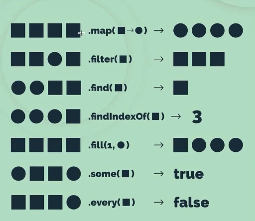

# 📔 8-dars

## Global and local variable scope(Qo'llanish doirasi)


- Window
- Global
- Local

O'zgaruvchi global yoki mahalliy yoki oyna doirasida e'lon qilinishi mumkin. Biz global va mahalliy miqyosni ko'ramiz. Let, var yoki constsiz e'lon qilingan har qanday narsa oyna darajasida qamrab olinadi.

Tasavvur qilaylik, bizda scope.js fayli bor.

### Window (Qo'llanish doirasi)

console.log() dan foydalanmasdan brauzeringizni oching va tekshiring, agar brauzerda a yoki b yozsangiz, a va b qiymatini ko'rasiz. Bu oynada a va b allaqachon mavjud degan ma'noni anglatadi.

```js
//scope.js
a = 'JavaScript' // har qanday joyda topiladigan oyna doirasi 
b = 10 // bu oyna doirasi o'zgaruvchisi 
function letsLearnScope() {
  console.log(a, b)
  if (true) {
    console.log(a, b)
  }
}
console.log(a, b) // chaqirish mumkin
```

### Global (Qo'llanish doirasi)

Global e'lon qilingan o'zgaruvchiga bitta faylning hamma joyidan kirish mumkin. Ammo global atama nisbiydir. U fayl uchun global bo'lishi mumkin yoki ba'zi kodlar blokiga nisbatan global bo'lishi mumkin.

```js
//scope.js
let a = 'JavaScript' //  global qamrov bu faylning istalgan joyidan topiladi 
let b = 10 //  global qamrov bu fayl 
function letsLearnScope() {
  console.log(a, b) //  JavaScript 10, kirish mumkin 
  if (true) {
    let a = 'Python'
    let b = 100
    console.log(a, b) // Python 100
  }
  console.log(a, b)
}
letsLearnScope()
console.log(a, b) // JavaScript 10, kirish mumkin
```

### Local (Qo'llanish doirasi)

Mahalliy deb e'lon qilingan o'zgaruvchiga faqat ma'lum blok kodida kirish mumkin.

```js
//scope.js
let a = 'JavaScript' // global qamrov bu faylning istalgan joyidan topiladi 
let b = 10 // global qamrov bu fayl 
function letsLearnScope() {
  console.log(a, b) //  JavaScript 10, kirish mumkin 
  let value = false
  if (true) {
    // biz funksiyadan va funksiyadan tashqariga kira olamiz, lekin 
    // if ichida eʼlon qilingan oʻzgaruvchilarga if blokidan tashqari kirish imkoni boʻlmaydi.
    let a = 'Python'
    let b = 20
    let c = 30
    let d = 40
    value = !value
    console.log(a, b, c) // Python 20 30
  }
  // biz c ga kira olmaymiz, chunki c ning qamrovi faqat if blok
  console.log(a, b, value) // JavaScript 10 true
}
letsLearnScope()
console.log(a, b) //  JavaScript 10, kirish mumkin 
```

Endi siz qamrov haqida tushunchaga egasiz. Var bilan e'lon qilingan o'zgaruvchi faqat funktsiya uchun mo'ljallangan, lekin let yoki const bilan e'lon qilingan o'zgaruvchi blok doirasi (funktsiya bloki, if bloki, sikl bloki va boshqalar). JavaScript-dagi blokirovka bu ikki jingalak qavs ({}) orasidagi koddir.

```js
//scope.js
function letsLearnScope() {
  var gravity = 9.81
  console.log(gravity)

}
// console.log(gravity), Tugallanmagan ReferenceError: tortishish aniqlanmagan

if (true){
  var gravity = 9.81
  console.log(gravity) // 9.81
}
console.log(gravity)  // 9.81

for(var i = 0; i < 3; i++){
  console.log(i) // 1, 2, 3
}
console.log(i)

```

ES6 va undan yuqori versiyalarda let va const mavjud, shuning uchun siz var ning hiyla-nayrangidan aziyat chekmaysiz . Biz ishlatganimizda let o'zgaruvchimiz bloklangan bo'ladi va u kodimizning boshqa qismlarini yuqtirmaydi.

```js
//scope.js
function letsLearnScope() {
  //  let yoki const dan foydalanishingiz mumkin, lekin tortishish kuchi doimiy Men const 
  const gravity = 9.81
  console.log(gravity)

}
// console.log(gravity), Tugallanmagan ReferenceError: tortishish aniqlanmagan

if (true){
  const  gravity = 9.81
  console.log(gravity) // 9.81
}
// console.log(gravity),  Tugallanmagan ReferenceError: tortishish aniqlanmagan

for(let i = 0; i < 3; i++){
  console.log(i) // 1, 2, 3
}
// console.log(i), Tugallanmagan ReferenceError: i aniqlanmagan

```

Let va const doirasi bir xil. Farqi faqat qayta tayinlash. Biz const o'zgaruvchisining qiymatini o'zgartira olmaymiz yoki qayta tayinlay olmaymiz. Let va const dan foydalanishni qat'iy tavsiya qilaman, let va const dan foydalanib , siz toza kod yozasiz va disk raskadrovka qilish qiyin bo'lgan xatolardan qochasiz. Qoida tariqasida, har qanday o'zgaruvchan qiymat uchun let , har qanday doimiy qiymat uchun const va massiv, ob'ekt, o'q funktsiyasi va funksiya ifodasi uchun foydalanishingiz mumkin.

##  Object

Hamma narsa ob'ekt bo'lishi mumkin va ob'ektlarning xususiyatlari va xususiyatlari qiymatlarga ega, shuning uchun ob'ekt kalit qiymat juftligidir. Kalitning tartibi zaxiralanmagan yoki buyurtma yo'q. Ob'ektning literalini yaratish uchun biz ikkita jingalak qavsdan foydalanamiz.

### Bo'sh Obyekt yaratish

Bo'sh ob'ekt

```js
const person = {}
```

### Qiymatlar bilan Obyekt yaratish

Endi shaxs ob'ekti ismi, familiyasi, yoshi, joylashuvi, ko'nikmalari va isMarried xususiyatlariga ega. Xususiyatlar yoki kalitlarning qiymati qator, raqam, mantiqiy, ob'ekt, null, aniqlanmagan yoki funktsiya bo'lishi mumkin.

Keling, ob'ektning ba'zi misollarini ko'rib chiqaylik. Har bir kalit ob'ektda qiymatga ega.

```js
const rectangle = {
  length: 20,
  width: 20
}
console.log(rectangle) // {length: 20, width: 20}

const person = {
  firstName: 'Asabeneh',
  lastName: 'Yetayeh',
  age: 250,
  country: 'Finland',
  city: 'Helsinki',
  skills: [
    'HTML',
    'CSS',
    'JavaScript',
    'React',
    'Node',
    'MongoDB',
    'Python',
    'D3.js'
  ],
  isMarried: true
}
console.log(person)
```

### Ob'ektdan qiymatlarni olish

Ob'ektning qiymatlariga ikkita usul yordamida kirishimiz mumkin:

- yordamida. Agar kalit nomi bitta so'zdan iborat bo'lsa, keyin kalit nomi
- kvadrat qavs va tirnoq yordamida

```js
const person = {
  firstName: 'Asabeneh',
  lastName: 'Yetayeh',
  age: 250,
  country: 'Finland',
  city: 'Helsinki',
  skills: [
    'HTML',
    'CSS',
    'JavaScript',
    'React',
    'Node',
    'MongoDB',
    'Python',
    'D3.js'
  ],
  getFullName: function() {
    return `${this.firstName}${this.lastName}`
  },
  'phone number': '+3584545454545'
}

//  yordamida qiymatlarga kirish. 
console.log(person.firstName)
console.log(person.lastName)
console.log(person.age)
console.log(person.location)

// qiymatga kvadrat qavs va kalit nomi yordamida kirish mumkin
console.log(person['firstName'])
console.log(person['lastName'])
console.log(person['age'])
console.log(person['age'])
console.log(person['location'])

// masalan, telefon raqamiga kirish uchun biz faqat kvadrat qavs usulidan foydalanamiz
console.log(person['phone number'])
```

### Ob'ekt methodlarini yaratish

Endi shaxs obyekti getFullName xususiyatlariga ega. getFullName - bu shaxs ob'ektidagi funksiya va biz uni ob'ekt usuli deb ataymiz. Ushbu kalit so'z ob'ektning o'ziga tegishli. Ob'ektning turli xususiyatlarining qiymatlariga kirish uchun this so'zidan foydalanishimiz mumkin . Biz strelka funksiyasidan ob'ekt usuli sifatida foydalana olmaymiz, chunki bu so'z ob'ektning o'rniga o'q funksiyasi ichidagi oynaga ishora qiladi.
Ob'ektga misol:

```js
const person = {
  firstName: 'Asabeneh',
  lastName: 'Yetayeh',
  age: 250,
  country: 'Finland',
  city: 'Helsinki',
  skills: [
    'HTML',
    'CSS',
    'JavaScript',
    'React',
    'Node',
    'MongoDB',
    'Python',
    'D3.js'
  ],
  getFullName: function() {
    return `${this.firstName} ${this.lastName}`
  }
}

console.log(person.getFullName())
// Asabeneh Yetayeh
```

### Ob'ekt uchun yangi kalitni o'rnatish

Ob'ekt - bu o'zgaruvchan ma'lumotlar tuzilmasi va biz ob'ekt yaratilgandan so'ng uning mazmunini o'zgartirishimiz mumkin.

Ob'ektga yangi kalitlarni o'rnatish

```js
const person = {
  firstName: 'Asabeneh',
  lastName: 'Yetayeh',
  age: 250,
  country: 'Finland',
  city: 'Helsinki',
  skills: [
    'HTML',
    'CSS',
    'JavaScript',
    'React',
    'Node',
    'MongoDB',
    'Python',
    'D3.js'
  ],
  getFullName: function() {
    return `${this.firstName} ${this.lastName}`
  }
}
person.nationality = 'Ethiopian'
person.country = 'Finland'
person.title = 'teacher'
person.skills.push('Meteor')
person.skills.push('SasS')
person.isMarried = true

person.getPersonInfo = function() {
  let skillsWithoutLastSkill = this.skills
    .splice(0, this.skills.length - 1)
    .join(', ')
  let lastSkill = this.skills.splice(this.skills.length - 1)[0]

  let skills = `${skillsWithoutLastSkill}, and ${lastSkill}`
  let fullName = this.getFullName()
  let statement = `${fullName} is a ${this.title}.\nHe lives in ${this.country}.\nHe teaches ${skills}.`
  return statement
}
console.log(person)
console.log(person.getPersonInfo())
```

```sh
Asabeneh Yetayeh is a teacher.
He lives in Finland.
He teaches HTML, CSS, JavaScript, React, Node, MongoDB, Python, D3.js, Meteor, and SasS.
```

### Ob'ekt methodlari

Ob'ektni manipulyatsiya qilishning turli usullari mavjud. Keling, ba'zi mavjud usullarni ko'rib chiqaylik.

_Object.assign_:  Asl ob'ektni o'zgartirmasdan ob'ektni nusxalash uchun

```js
const person = {
  firstName: 'Asabeneh',
  age: 250,
  country: 'Finland',
  city:'Helsinki',
  skills: ['HTML', 'CSS', 'JS'],
  title: 'teacher',
  address: {
    street: 'Heitamienkatu 16',
    pobox: 2002,
    city: 'Helsinki'
  },
  getPersonInfo: function() {
    return `I am ${this.firstName} and I live in ${this.city}, ${this.country}. I am ${this.age}.`
  }
}

//Obyekt methodlari: Object.assign, Object.keys, Object.values, Object.entries
//hasOwnProperty

const copyPerson = Object.assign({}, person)
console.log(copyPerson)
```

#### Object.keys() yordamida obyekt kalitlarini olish

_Object.keys_: Ob'ektning kalitlari yoki xususiyatlarini massiv sifatida olish uchun

```js
const keys = Object.keys(copyPerson)
console.log(keys) //['name', 'age', 'country', 'skills', 'address', 'getPersonInfo']
const address = Object.keys(copyPerson.address)
console.log(address) //['street', 'pobox', 'city']
```

#### Object.values() yordamida obyekt qiymatlarini olish

_Object.values_: Ob'ektning qiymatlarini massiv sifatida olish uchun

```js
const values = Object.values(copyPerson)
console.log(values)
```

#### Object.entries() yordamida obyekt kalitlari va qiymatlarini olish

_Object.entries_: Massivdagi kalit va qiymatlarni olish uchun

```js
const entries = Object.entries(copyPerson)
console.log(entries)
```

#### hasOwnProperty() yordamida xususiyatlarni tekshirish

_hasOwnProperty_: ob'ektda ma'lum bir kalit yoki xususiyat mavjudligini tekshirish uchun

```js
console.log(copyPerson.hasOwnProperty('name'))
console.log(copyPerson.hasOwnProperty('score'))
```

## Savol?

```js
const arr1 = [1, 2, 3, 4];
const arr2 = [1, 2, 3, 4];

arr1 == arr2; // ?
// Ikkita birhil ojbect bir biriga teng bo'ladimi?
```
#### Javob
Yoq ikkita birhil object bir biriga teng bo'la olmaydi! Sababi ikkita obj har safar create bo'lganda memoriyda joy oldai va o'sha joyning adresi bo'ladi shunda codimiz qanaqa o'qiladi? Codimiz o'qilayotganda objning valuesi emas balki memoriyning adresi bir biri bilan solishtiriladi va ikkala memoriyning adresi harxil chiqadi shuning uchun ikkala object bir biri bilan teng bo'la olmaydi! 

## Yuqori tartibli funktsiya

Yuqori tartibli funksiyalar(Higher order functions - `HOF` deb aytiladi) boshqa funksiyani parametr sifatida qabul qiladigan yoki funktsiyani qiymat sifatida qaytaradigan funksiyalardir. Parametr sifatida berilgan funksiya qayta qo'ng'iroq deb ataladi.

### Callback (Chaqiruv)

Callback (Chaqiruv) ya'ni `callback` - bu boshqa funktsiyaga parametr sifatida o'tkazilishi mumkin bo'lgan funksiya. Quyidagi misolga qarang.

```js
// a callback function, funksiya ixtiyoriy nomlanishi mumkin
const callback = (n) => {
  return n ** 2
}
​
// funksiya bu yerda callback sifatida boshqa bir funksiyani parametr sifatida qabul qilib turibdi
function cube(callback, n) {
  return callback(n) * n
}
​
console.log(cube(callback, 3))
```

### Qaytish funktsiyasi

Higher order funksiyalarari qiymat sifatida funksiya qaytaradi
​

```js
// Higher order funksiyasi boshqa bir funksiyani qaytarayapti
const higherOrder = n => {
  const doSomething = m => {
    const doWhatEver = t => {
      return 2 * n + 3 * m + t
    }
    return doWhatEver
  }
  return doSomething
}
console.log(higherOrder(2)(3)(10))
```
higherOrder - bu yuqori tartibdagi funksiya, uning parametri n. U doSomething funksiyasini qaytaradi.
doSomething - bu ham yuqori tartibdagi funksiya, uning parametri m. U esa doWhatEver funksiyasini qaytaradi.
doWhatEver - bu ham yuqori tartibdagi funksiya, uning parametri t. U esa 2 * n + 3 * m + t formulasi bilan hisoblashni amalga oshiradi.
Yuqoridagi funksiyalar ketma-ketligi natijasida, o'zgartirilgan qiymatlarni qabul qilib, doWhatEver funksiyasini chaqirish orqali o'z ichiga olgan formulani hisoblaydi. Natijada, higherOrder(2)(3)(10) qilganda 2, 3 va 10 qiymatlari orqali hisoblangan natija 23 bo'ladi.

n qiymati 2 ga teng.
m qiymati 3 ga teng.
t qiymati 10 ga teng.
Shu bilan, 2 * 2 + 3 * 3 + 10 formulasi natijasida 23 chiqadi. Natijada, higherOrder(2)(3)(10) ifodasi 23 ga teng bo'ladi.

Callback funksiyalaridan foydalanganimizni ko'rib chiqaylik. Masalan, _**forEach**_ methodi qayta `callback`dan foydalanadi.

```js
const numbers = [1, 2, 3, 4]
​
const sumArray = arr => {
  let sum = 0
  const callback = function(element) {
    sum += element
  }
  arr.forEach(callback)
  return sum

}
console.log(sumArray(numbers))
```

```sh
15
```

Yuqoridagi misolni quyidagicha soddalashtirish mumkin:

```js
const numbers = [1, 2, 3, 4]
​
const sumArray = arr => {
  let sum = 0
  arr.forEach(function(element) {
    sum += element
  })
  return sum

}
console.log(sumArray(numbers))
```

```sh
15
```

### Vaqtni sozlash

JavaScript-da biz ba'zi harakatlarni ma'lum vaqt oralig'ida bajarishimiz yoki ba'zi harakatlarni bajarish uchun biroz vaqt rejalashtirishimiz (kutishimiz) mumkin.

- setInterval
- setTimeout

#### SetInterval funksiyasi yordamida Interavalni o'rnatish

JavaScript-da biz ma'lum vaqt oralig'ida doimiy ravishda ba'zi harakatlarni bajarish uchun setInterval yuqori tartibli funksiyasidan foydalanamiz. setInterval global usuli parametr sifatida qayta qo'ng'iroq qilish funktsiyasi va davomiylikni oladi. Davomiylik millisekundlarda va qayta qo'ng'iroq har doim shu vaqt oralig'ida chaqiriladi.

```js
// syntax
function callback() {
  // code goes here
}
setInterval(callback, duration)
```

```js
function sayHello() {
  console.log('Hello')
}
setInterval(sayHello, 1000) // u har soniyada 'Hello' chop etadi, 1000ms = 1sekund
```

#### SetTimeout yordamida vaqtni belgilash

JavaScript-da biz kelajakda biron bir amalni bajarish uchun setTimeout yuqori tartibli funksiyasidan foydalanamiz. setTimeout global usuli parametr sifatida `callback` funktsiyasi va davomiylikni oladi. Davomiylik millisekundlarda va `callback` shu vaqtni kutadi.

```js
// syntax
function callback() {
  // code goes here
}
setTimeout(callback, duration) // duration(davomiyligi) millisekundlarda
```

```js
function sayHello() {
  console.log('Hello')
}
setTimeout(sayHello, 2000) // u 2 soniya kutgandan so'ng 'Hello' chop etadi.
```

## Funktsional dasturlash

Oddiy tsiklni yozish o'rniga, JavaScript-ning so'nggi versiyasi bizga murakkab muammolarni hal qilishda yordam beradigan ko'plab o'rnatilgan usullarni taqdim etdi. Barcha o'rnatilgan usullar qayta qo'ng'iroq qilish funktsiyasini oladi. Ushbu bo'limda biz _forEach_ , _map_ , _filter_ , _kamaytirish_ , _find_ , _every_ , _some_ , va _sort_ ni ko'rib chiqamiz .

### forEach

_forEach_: massiv elementlarini takrorlash. Biz forEach dan faqat massivlar bilan foydalanamiz. U elementlar, indeks parametri va massivning o'zi bilan qayta qo'ng'iroq qilish funktsiyasini oladi. Indeks va massiv ixtiyoriy.

```js
arr.forEach(function (element, index, arr) {
  console.log(index, element, arr)
})
// Yuqoridagi kodni o'q funktsiyasi yordamida yozish mumkin
arr.forEach((element, index, arr) => {
  console.log(index, element, arr)
})
// Yuqoridagi kod o'q funktsiyasi va aniq qaytish yordamida yozilishi mumkin
arr.forEach((element, index, arr) => console.log(index, element, arr))
```

```js
let sum = 0;
const numbers = [1, 2, 3, 4, 5];
numbers.forEach(num => console.log(num))
console.log(sum)
```

```sh
1
2
3
4
5
```

```js
let sum = 0;
const numbers = [1, 2, 3, 4, 5];
numbers.forEach(num => sum += num)

console.log(sum)
```

```sh
15
```

```js
const countries = ['Finland', 'Denmark', 'Sweden', 'Norway', 'Iceland']
countries.forEach((element) => console.log(element.toUpperCase()))
```

```sh
FINLAND
DENMARK
SWEDEN
NORWAY
ICELAND
```

### map

_map_: massiv elementlarini takrorlash va massiv elementlarini o‘zgartirish. U elementlar, indeks, massiv parametrlari bilan qayta qo'ng'iroq qilish funktsiyasini oladi va yangi massivni qaytaradi.

```js
const modifiedArray = arr.map(function (element, index, arr) {
  return element
})
```

```js
/* Strelkali funksiya return yozmagan holda
const modifiedArray = arr.map((element,index) => element);
*/
//Misol
const numbers = [1, 2, 3, 4, 5]
const numbersSquare = numbers.map((num) => num * num)

console.log(numbersSquare)
```

```sh
[1, 4, 9, 16, 25]
```

```js
const names = ['Asabeneh', 'Mathias', 'Elias', 'Brook']
const namesToUpperCase = names.map((name) => name.toUpperCase())
console.log(namesToUpperCase)
```

```sh
['ASABENEH', 'MATHIAS', 'ELIAS', 'BROOK']
```

```js
const countries = [
  'Albania',
  'Bolivia',
  'Canada',
  'Denmark',
  'Ethiopia',
  'Finland',
  'Germany',
  'Hungary',
  'Ireland',
  'Japan',
  'Kenya',
]
const countriesToUpperCase = countries.map((country) => country.toUpperCase())
console.log(countriesToUpperCase)

/*
// Strelkali funksiya
const countriesToUpperCase = countries.map((country) => {
  return country.toUpperCase();
})
// Strelkali funksiya return yozmagan holda
const countriesToUpperCase = countries.map(country => country.toUpperCase());
*/
```

```sh
['ALBANIA', 'BOLIVIA', 'CANADA', 'DENMARK', 'ETHIOPIA', 'FINLAND', 'GERMANY', 'HUNGARY', 'IRELAND', 'JAPAN', 'KENYA']
```

```js
const countriesFirstThreeLetters = countries.map((country) =>
  country.toUpperCase().slice(0, 3)
)
```

```sh
 ["ALB", "BOL", "CAN", "DEN", "ETH", "FIN", "GER", "HUN", "IRE", "JAP", "KEN"]
```

**forEach va map massiv elementlari bilan ishlashda foydalaniladigan JavaScript array metodlari. Ularning farqini quyidagicha:**
Map yangi massiv qaytaradi eski massivni qiymatini o'zgartirib 
**Qaytari:**

forEach: Bu metod undefined qaytaradi. U bitta elementni chaqiradi va biror nima qaytarmaydi.
map: Bu metod yangi bir array yaratadi va har bir element uchun callback funksiyasi qaytargan qiymatlarni yangi array elementlari sifatida o'z ichiga oladi.

**Qo'llanish:**

forEach: Bu metod asosan bir operatsiya uchun ishlatiladi, masalan, ekranga chiqarish yoki qaysi elementlarda qanday amaliyot bajarilishi kerakligini aniqlash uchun.
map: Bu metod esa yangi bir array yaratish uchun ishlatiladi, bu array orqali amaliyot bajarilgan natijani qaytaradi.

```js
// forEach
const numbers = [1, 2, 3, 4];

const result = numbers.forEach(function(element, index) {
  console.log(`Element: ${element}, Index: ${index}`);
});

console.log(result); //  Output: undefined

// map
const doubledNumbers = numbers.map(function(element, index) {
  return element * 2;
});
console.log(doubledNumbers); // Output: [2, 4, 6, 8]

```

### filter

_Filter_: filter JavaScript array metodidir va u massivni filtirlash uchun ishlatiladi. filter metodining asosiy maqsadi, berilgan shartlarni qondirish orqali massivni yangi massivga filtrlash va shartga mos keladigan elementlarni olishdir.

```js
const numbers = [1, 2, 3, 4, 5, 6];

// Odd numbers ni olish
const oddNumbers = numbers.filter(function(element) {
  return element % 2 !== 0;
});

console.log(oddNumbers); 
```

```sh
// [1, 3, 5]
```

```js
const countries = ['Albania', 'Argentina', 'Australia', 'Austria', 'Bulgaria', 'Cambodia', 'India', 'Hitoy', 'Jamaica', 'Japan', 'Korea'];

const countriesEndsByia = countries.filter((country) => country.endsWith('ia'));

console.log(countriesEndsByia);
```

```sh
["Albania", "Australia", "Austria", "Bulgaria", "Cambodia", "India"]
```

```js
const countriesHaveFiveLetters = countries.filter(
  (country) => country.length === 5
)
console.log(countriesHaveFiveLetters)
```

```sh
['Japan', 'Kenya']
```

```js
const scores = [
  { name: 'Asabeneh', score: 95 },
   { name: 'Lidiya', score: 98 },
  { name: 'Mathias', score: 80 },
  { name: 'Elias', score: 50 },
  { name: 'Martha', score: 85 },
  { name: 'John', score: 100 },
]

const scoresGreaterEight = scores.filter((score) => score.score > 80)
console.log(scoresGreaterEight)
```

```sh
[{name: 'Asabeneh', score: 95}, { name: 'Lidiya', score: 98 },{name: 'Martha', score: 85},{name: 'John', score: 100}]
```



### reduce

```js
const products = [
  { name: "Olma", price: "12000" },
  { name: "Anor", price: "20000" },
  { name: "Banan", price: "30000" },
  { name: "Olcha", price: "22000" },
];

// reduce(previousValue, curentValue, currentIndex, arr) qabul qiladi
const products = [
  { name: "Olma", price: 12000 },
  { name: "Anor", price: 20000 },
  { name: "Banan", price: 30000 },
  { name: "Olcha", price: 22000 },
];

let sum = products.reduce((acumlator, curentValue) => {
  return acumlator + curentValue.price
}, 0);
console.log(sum);


const items = [
  { name: 'Apple', category: 'Fruit' },
  { name: 'Onion', category: 'Vegetable' },
  { name: 'Orange', category: 'Fruit' },
  { name: 'Lettuce', category: 'Vegetable' },
];

const groupedItems = items.reduce((accumulator, item) => {
  const category = item.category;
  console.log(accumulator[category], 's')
  if(!accumulator[category]){
    accumulator[category] = []
  }
  accumulator[category].push(item.name)
  return accumulator
}, {})

console.log(groupedItems);
```

### every

_every_: Barcha elementlarning bir jihatda oʻxshashligini tekshiring. Bu booleanni qaytaradi

```js
const names = ['Asabeneh', 'Mathias', 'Elias', 'Brook']
const areAllStr = names.every((name) => typeof name === 'string') // Are all strings?

console.log(arrAllStr)
```

```sh
true
```

```js
const bools = [true, true, true, true]
const areAllTrue = bools.every((b) => b === true) // Hammasi rostmi?

console.log(areAllTrue) // rost
```

```sh
true

```

### find

_find_: Shartni qondiradigan birinchi elementni qaytaring

```js
const ages = [24, 22, 25, 32, 35, 18]
const age = ages.find((age) => age < 20)

console.log(age)
```

```js
18
```

```js
const names = ['Asabeneh', 'Mathias', 'Elias', 'Brook']
const result = names.find((name) => name.length > 7)
console.log(result)
```

```sh
Asabeneh
```

```js
const scores = [
  { name: 'Asabeneh', score: 95 },
  { name: 'Mathias', score: 80 },
  { name: 'Elias', score: 50 },
  { name: 'Martha', score: 85 },
  { name: 'John', score: 100 },
]

const score = scores.find((user) => user.score > 80)
console.log(score)
```

```sh
{ name: "Asabeneh", score: 95 }
```

### findIndex

_findIndex_: Shartni qondiradigan birinchi elementning o'rnini qaytaring

```js
const names = ['Asabeneh', 'Mathias', 'Elias', 'Brook']
const ages = [24, 22, 25, 32, 35, 18]

const result = names.findIndex((name) => name.length > 7)
console.log(result) // 0

const age = ages.findIndex((age) => age < 20)
console.log(age) // 5
```

### some

_some_: Ba'zi elementlarning bir jihati bilan o'xshashligini tekshiring. Bu booleanni qaytaradi

```js
const names = ['Asabeneh', 'Mathias', 'Elias', 'Brook']
const bools = [true, true, true, true]

const areSomeTrue = bools.some((b) =>  b === true)

console.log(areSomeTrue) //true
```

```js
const areAllStr = names.some((name) => typeof name === 'number') // Are all strings ?
console.log(areAllStr) // false
```

### sort

_sort_: Saralash usullari massiv elementlarini o'sish yoki kamayish tartibida tartibga soladi. Odatiy bo'lib, sort() usuli qiymatlarni strings sifatida saralaydi. Bu qatorlar uchun yaxshi ishlaydi, lekin raqamlar uchun emas. Agar raqam qiymatlari satrlar sifatida tartiblangan bo'lsa va bu bizga noto'g'ri natija bersa. Saralash usuli asl massivni o'zgartiradi. Saralash usulidan foydalanishni boshlashdan oldin asl ma'lumotlarni nusxalash tavsiya etiladi .

#### Satr qiymatlarini saralash

```js
const products = ['Milk', 'Coffee', 'Sugar', 'Honey', 'Apple', 'Carrot']
console.log(products.sort()) // ['Apple', 'Carrot', 'Coffee', 'Honey', 'Milk', 'Sugar']
//Endi asl mahsulotlar qatori ham tartiblangan
```

#### Raqamli qiymatlarni saralash

Quyidagi misolda ko'rib turganingizdek, o'sish tartibida tartiblangandan keyin 100 birinchi bo'ldi. Saralash elementni string ga o'zgartiradi, chunki '100' va boshqa raqamlar taqqoslangan, '100' qatorining boshi eng kichik bo'lgan 1. Bunga yo'l qo'ymaslik uchun biz tartiblash usuli ichida manfiy, nol yoki musbat qaytaruvchi solishtirma qo'ng'iroq funksiyasidan foydalanamiz.

```js
const numbers = [9.81, 3.14, 100, 37]
// Raqamli elementlarni tartiblash uchun sort usulidan foydalanish noto'g'ri natija beradi. pastga qarang
console.log(numbers.sort()) //[100, 3.14, 37, 9.81]
numbers.sort(function (a, b) {
  return a - b
})

console.log(numbers) // [3.14, 9.81, 37, 100]

numbers.sort(function (a, b) {
  return b - a
})
console.log(numbers) //[100, 37, 9.81, 3.14]
```

#### Obyektli massivlarni saralash

Biz ob'ektlarni massivda saralaganimizda. Taqqoslash uchun obyekt tugmasidan foydalanamiz. Quyidagi misolni ko'rib chiqaylik.

```js
objArr.sort(function (a, b) {
  if (a.key < b.key) return -1
  if (a.key > b.key) return 1
  return 0
})

// or

objArr.sort(function (a, b) {
  if (a['key'] < b['key']) return -1
  if (a['key'] > b['key']) return 1
  return 0
})

const users = [
  { name: 'Asabeneh', age: 150 },
  { name: 'Brook', age: 50 },
  { name: 'Eyo', age: 100 },
  { name: 'Elias', age: 22 },
]
users.sort((a, b) => {
  if (a.age < b.age) return -1
  if (a.age > b.age) return 1
  return 0
})
console.log(users) // ortib borishda tartiblangan
// [{…}, {…}, {…}, {…}]
```


