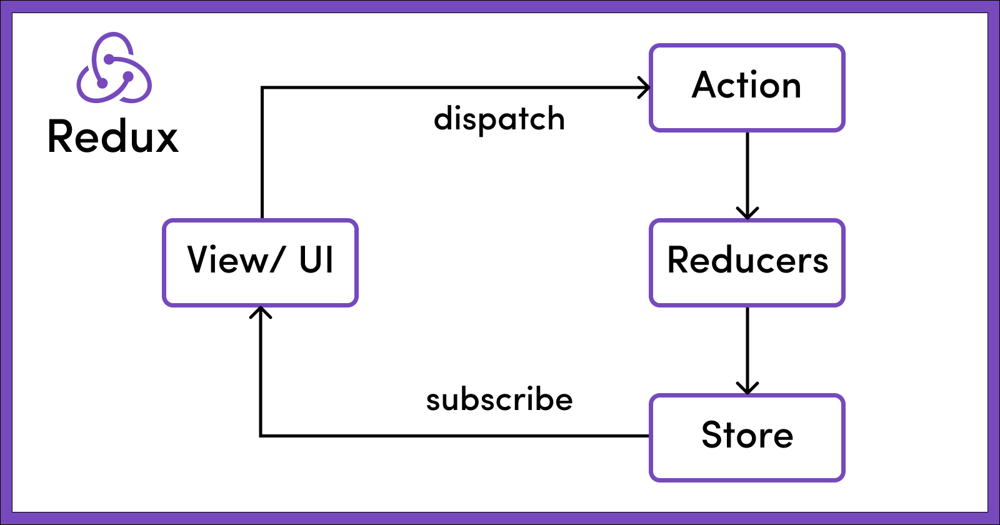
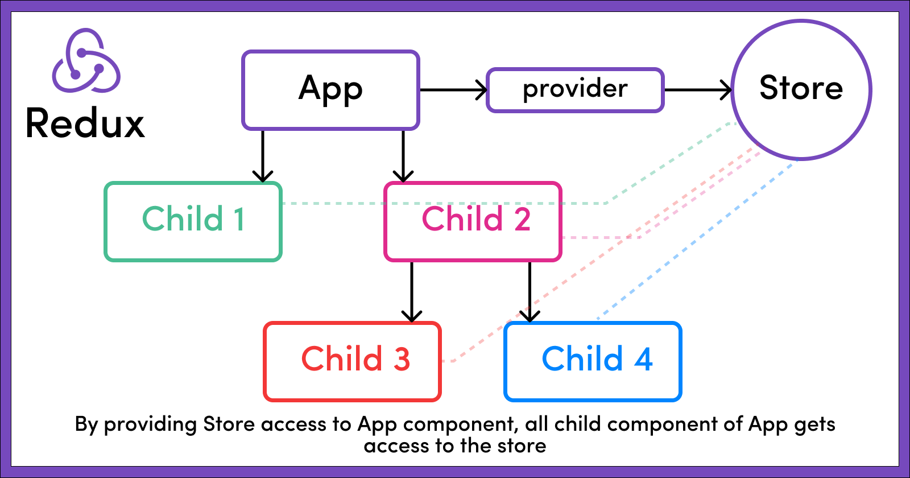

## 📔 18-dars

## Redux nima va qanday ishlaydi?

Redux nima? Yangi boshlanuvchilar uchun Store, Actions, va Reducers

Agar biz ushbu postni chuqurroq o'rgansak, Redux state managment(holat boshqaruvi) kutubxonasi ekanligini ko'ramiz, uni siz har qanday JS kutubxonasi yoki React, Angular yoki Vue kabilar bilan ishlatishingiz mumkin.!

<br />
Ushbu maqolada biz Redux asoslarini ko'rib chiqamiz. Biz Redux nima ekanligini va uning uchta asosiy tamoyilini bilib olamiz.

Shuningdek, biz uning asosiy qurilish bloklari qanday ishlashini ko'rib chiqamiz, masalan, store, actions, and reducers va ularning barchasi qanday birlashadi va Reduxni global davlat boshqaruvi kutubxonasiga aylantiradi.

### Nima uchun Redux-dan foydalanish kerak?

Xo'sh, ilova o'z holatiga ega, bu uning ichki komponentlari holatlarining kombinatsiyasi bo'lishi mumkin.

Masalan, elektron tijorat veb-saytini olaylik. Elektron tijorat veb-saytida savat komponenti, foydalanuvchi profili komponenti, avval ko'rilgan bo'lim komponenti va boshqalar kabi bir nechta komponentlar bo'ladi.

Biz foydalanuvchi savatidagi narsalar sonini ko'rsatadigan savat komponentini olamiz. Savat komponentining holati foydalanuvchi savatga qo‘shgan barcha elementlardan va ularning umumiy sonidan iborat bo‘ladi. Ilova har doim ishlayotgan bo'lsa, ushbu komponent foydalanuvchi savatidagi elementlarning yangilangan sonini ko'rsatishi kerak.

Har safar foydalanuvchi savatga biror narsa qo'shganda, ilova ushbu elementni savat ob'ektiga qo'shish orqali ushbu amalni ichki bajarishi kerak. U ichki holatini saqlab turishi va foydalanuvchiga UIdagi savatdagi narsalarning umumiy sonini ko'rsatishi kerak.

Xuddi shunday, buyumni savatdan olib tashlash, savatdagi narsalar sonini ichki qismda kamaytirishi kerak. U savat ob'ektidan elementni olib tashlashi va shuningdek, UIda savatdagi elementlarning yangilangan umumiy sonini ko'rsatishi kerak.

Biz ularning ichidagi komponentlarning ichki holatini juda yaxshi saqlab turishimiz mumkin, ammo dastur kattalashganda va u komponentlar o'rtasida ba'zi bir holatni bo'lishishi mumkin. Bu nafaqat ularni ko'rinishda ko'rsatish, balki ularni boshqarish yoki yangilash yoki ularning qiymatiga asoslangan ba'zi mantiqlarni bajarish uchun hamdir.

Bir nechta komponentlardan bir nechta holatlarni samarali boshqarish vazifasi, ilova hajmi kattalashganda qiyin bo'lishi mumkin.

Bu erda Redux rasmga tushadi. Davlat boshqaruvi kutubxonasi bo'lgan Redux asosan dasturning barcha holatlarini saqlaydi va boshqaradi.

Shuningdek, u bizga ba'zi muhim APIlarni taqdim etadi, ular yordamida biz mavjud holatga o'zgartirishlar kiritishimiz hamda ilovaning joriy holatini olishimiz mumkin.


### Reduxning asosiy tamoyillari


1. Redux store nima?
Redux store ilovaning barcha holatini saqlaydigan asosiy, markaziy bo'limdir.
Agar quyidagi kod parchasida ko'rsatilganidek, App.js ( komponentni teg ichida o'rash orqali ) store taqdim etilgan bo'lsak,uning barcha bolalari (bolalar komponentlari ) ham storedan ilova holatiga kirishlari mumkin. Bu uning global state sifatida harakat qilishiga olib keladi.App<Provider> </Provider>App.js

```js
// src/index.js

import React from 'react'
import ReactDOM from 'react-dom'
import { Provider } from 'react-redux'

import { App } from './App'
import createStore from './createReduxStore'

const store = createStore()

// As of React 18
const root = ReactDOM.createRoot(document.getElementById('root'))
root.render(
  <Provider store={store}>
    <App />
  </Provider>
)
```

Butun ilovaning holati quyida ko'rsatilganidek, bitta storeda JS ob'ekt daraxti shaklida saqlanadi.

### Amaliyot
Keling reduxda counter yasab ko'ramiz
<a href="https://github.com/QobilovSardor/redux-toolkit-loyiha" target="_blank">Kode manbasi</a>