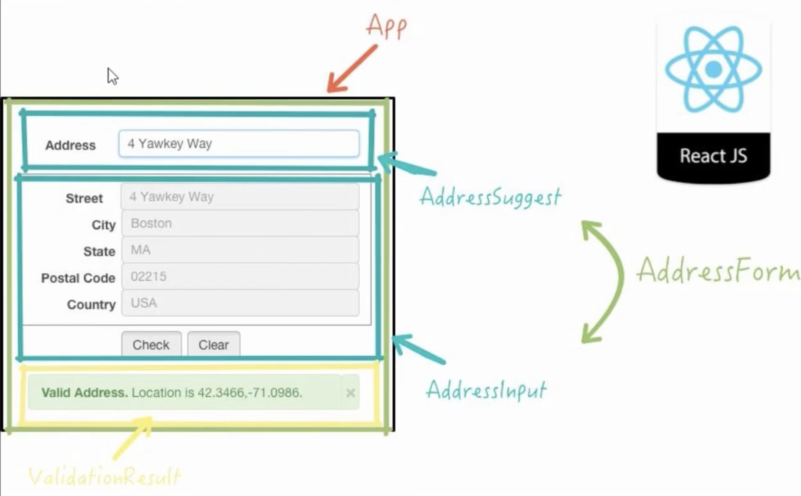
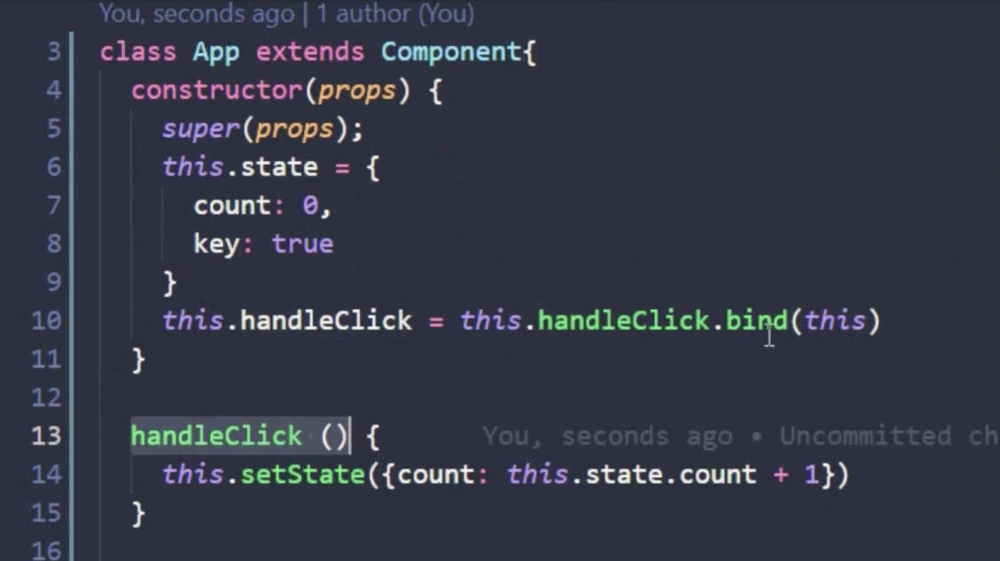
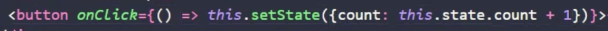

# 📔 2-dars

## Componenrlar haqida va Class componenrlar


#### ReactJS class Components
Komponentlar mustaqil va qayta ishlatiladigan kod bitlaridir. Ular JavaScript funksiyalari bilan bir xil maqsadga xizmat qiladi, lekin izolyatsiyada ishlaydi va HTMLni render() funksiyasi orqali qaytaradi.

Komponentlar ikki xil bo'ladi, Class komponentlari va Function komponentlari, bu bobda siz Class komponentlari haqida bilib olasiz.

## Class componentlar haqida

#### Class componentni yaratish

React komponentini yaratishda komponent nomi katta harf bilan boshlanishi kerak.

Komponent bayonotni o'z ichiga olishi kerak extends React.Component, bu bayonot React.Component uchun meros yaratadi va komponentingizga React.Component funksiyalariga kirish imkonini beradi.

Komponent ham render()usulni talab qiladi, bu usul HTMLni qaytaradi.

Misol: Car deb nomlangan class component yarataylik
```js
class Car extends React.Component {
  render() {
    return <h2>Hi, I am a Car!</h2>;
  }
}
```

#### Komponent konstruktori
constructor()Agar komponentingizda funksiya mavjud bo'lsa , komponent ishga tushganda bu funksiya chaqiriladi.

Konstruktor funksiyasi komponentning xususiyatlarini ishga tushiradigan joydir.

React-da komponent xususiyatlari deb nomlangan ob'ektda saqlanishi kerak state.

stateBu haqida keyinroq ushbu qo'llanmada ko'proq bilib olasiz .

Konstruktor funktsiyasi, shuningdek, asosiy komponentning konstruktor funktsiyasini bajaradigan bayonotni qo'shish orqali ota-komponentning merosini hurmat qilasiz super() va komponentingiz asosiy komponentning ( ) barcha funksiyalariga kirish huquqiga ega React.Component.

```js
class Car extends React.Component {
  constructor() {
    super();
    this.state = {color: "red"};
  }
  render() {
    return <h2>I am a Car!</h2>;
  }
}
//================================================================
class Car extends React.Component {
  constructor() {
    super();
    this.state = {color: "red"};
  }
  render() {
    return <h2>My car is color {this.state.color}</h2>;
  }
}
```
### Porpslar

Komponent xususiyatlarini boshqarishning yana bir usuli props - dan foydalanish.

Proplar funksiya argumentlariga o'xshaydi va siz ularni komponentga atributlar sifatida yuborasiz.

propsKeyingi bobda bu haqda ko'proq bilib olasiz .

```js
class Car extends React.Component {
  render() {
    return <h2>I am a {this.props.color} Car!</h2>;
  }
}

const root = ReactDOM.createRoot(document.getElementById('root'));
root.render(<Car color="red"/>);
```


#### Constructordagi Props

Agar komponentingiz konstruktor funksiyasiga ega bo'lsa, rekvizitlar har doim konstruktorga, shuningdek, usul orqali React.Componentga uzatilishi kerak super().

```js
class Car extends React.Component {
  constructor(props) {
    super(props);
  }
  render() {
    return <h2>I am a {this.props.model}!</h2>;
  }
}

const root = ReactDOM.createRoot(document.getElementById('root'));
root.render(<Car model="Mustang"/>);
```
## Amaliyor counter yasash class componentlarda

## Clas componenrlarda metodlar yaratish

2.usul bin yordamida bog'lash


3.usul anonim funksiya


## Amaliyot
To'liq functionalga ega clicker(counter) yarating

1.Uchta tugmacha yarating birrinchisi incr(+) ikkingchi tugmacha decr(-) uchunchi tugmacha reset u bosilganda count 0ga teng bo'lishi kerak.

Qo'shimcha shu counter uchun bitta functiadan foydalaning

## Hayotiy tsikl(Lifecycle) tushunchasi va React komponenti 

#### Komponentlarning hayot aylanishi
React-ning har bir komponentida uning uchta asosiy bosqichida kuzatishingiz va boshqarishingiz mumkin bo'lgan hayot aylanishi mavjud.

Uch bosqich: o'rnatish(Mounting) , yangilash(Updating) va o'chirish(Unmounting) .

#### Constructor
method hamma narsadan oldin, komponent ishga tushirilganda chaqiriladi va bu boshlang'ich va boshqa boshlang'ich qiymatlarni constructor()o'rnatish uchun tabiiy joydir.

method argument sifatida , constructor()bilan chaqiriladi propsva siz har doim hamma narsadan oldin ni chaqirishdan boshlashingiz kerak super(props), bu ota-onaning konstruktor usulini ishga tushiradi va komponentga o'zining ota-onasidan ( React.Component) usullarni meros qilib olish imkonini beradi.

#### Misol
method constructorhar safar komponent yaratganingizda React tomonidan chaqiriladi:

```js
class Header extends React.Component {
  constructor(props) {
    super(props);
    this.state = {favoritecolor: "red"};
  }
  render() {
    return (
      <h1>My Favorite Color is {this.state.favoritecolor}</h1>
    );
  }
}
```

#### componentDidMount()
componentDidMount() komponent ko'rsatilgandan keyin chaqiriladi.

Bu erda komponent allaqachon DOM-ga joylashtirilgan bo'lishini talab qiluvchi bayonotlarni ishga tushirasiz.

#### Misol:
Avvaliga mening eng yaxshi ko'rgan rangim qizil, lekin menga bir soniya bering va uning o'rniga uni sriqa aylantiraman:

```js
class Header extends React.Component {
  constructor(props) {
    super(props);
    this.state = {favoritecolor: "red"};
  }
  componentDidMount() {
    setTimeout(() => {
      this.setState({favoritecolor: "yellow"})
    }, 1000)
  }
  render() {
    return (
      <h1>My Favorite Color is {this.state.favoritecolor}</h1>
    );
  }
}
```


<br /><br />


## componentDidUpdate()
<b>componentDidUpdatekomponent()</b> DOMda yangilangandan keyin chaqiriladi.

Quyidagi misol murakkab bo'lib tuyulishi mumkin, ammo u faqat shunday qiladi:

Komponent o'rnatilganda u sevimli rang "qizil" bilan ko'rsatiladi.

Komponent o'rnatilgandan so'ng, taymer holatni o'zgartiradi va rang "sariq" bo'ladi.

Ushbu harakat yangilanish bosqichini ishga tushiradi va ushbu komponentda componentDidUpdateusul mavjud bo'lganligi sababli, bu usul bajariladi va bo'sh DIV elementiga xabar yozadi:

Misol:
```js
class Header extends React.Component {
  constructor(props) {
    super(props);
    this.state = {favoritecolor: "red"};
  }
  componentDidMount() {
    setTimeout(() => {
      this.setState({favoritecolor: "yellow"})
    }, 1000)
  }
  componentDidUpdate() {
    document.getElementById("mydiv").innerHTML =
    "The updated favorite is " + this.state.favoritecolor;
  }
  render() {
    return (
      <div>
      <h1>My Favorite Color is {this.state.favoritecolor}</h1>
      <div id="mydiv"></div>
      </div>
    );
  }
}
```

## Unmounting(O'chirish)
Hayotiy tsiklning keyingi bosqichi komponent DOM dan o'chirilishi yoki React uni chaqirishni yoqtirganidek uzilishidir .

React faqat bitta o'rnatilgan usulga ega bo'lib, komponent o'chirilganda chaqiriladi:

componentWillUnmountkomponent DOMdan olib tashlanishi arafasida bo'lganda chaqiriladi.

<b>Misol:</b>
```js
import React from "react";
class Container extends React.Component {
	constructor(props) {
		super(props);
		this.state = { show: true };
	}
	delHeader = () => {
		this.setState({ show: false });
	}
	render() {
		let myheader;
		if (this.state.show) {
			myheader = <Child />;
		};
		return (
			<div>
				{myheader}
				<button type="button" onClick={this.delHeader}>Delete Header</button>
			</div>
		);
	}
}

class Child extends React.Component {
	componentWillUnmount() {
		alert("The component named Header is about to be unmounted.");
	}
	render() {
		return (
			<h1>Salom dusnyo</h1>
		);
	}
}
export default Container
```