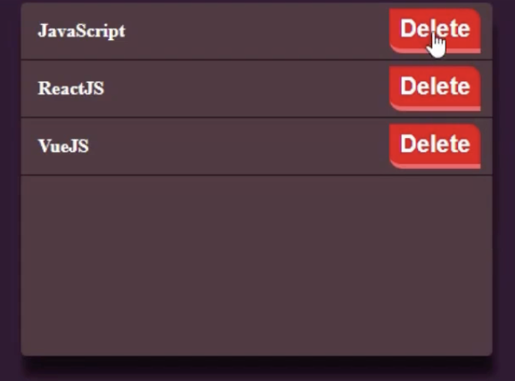

# 📔 3-dars

## Amaliyot Hayotiy tsikl(Lifecycle) Counter misolida

```js
import React from 'react'

export default class Nimadir extends React.Component {
	constructor(props) {
		super(props);
		this.state = {
			count: 0,
			isCounting: false
		}
	}
	componentDidMount(){ 
		console.log('componentDidMount');
		const userCount = localStorage.getItem("timer")
		if(userCount){
			this.setState({count: +userCount})
		}

	}
	componentDidUpdate() {
		console.log('componentDidUpdate');
		localStorage.setItem("timer", this.state.count);
	}
	componentWillUnmount() {
		console.log('componentWillUnmount');
	}
	hendleStart = () => {
		this.setState({isCounting: true});
		
		this.counterId = setInterval(() => {
			this.setState({ count: this.state.count+1})
		}, 1000)
	}

	hendleStop = () => {
		this.setState({isCounting: false})
		clearInterval(this.counterId)
	}
	hendleReset = () => {
		this.setState({isCounting: false, count: 0})
		clearInterval(this.counterId)
	}

	render() {
		return (
			<>
				<h3>React timer</h3>
				<h2>{this.state.count}</h2>
				{!this.state.isCounting ?
					<button onClick={this.hendleStart}>Start</button>
					: (
						<button onClick={this.hendleStop}>Stop</button>
					)
				}
				<button onClick={this.hendleReset}>Reset</button>
			</>
		)
	}

}
```

## Porps

Props React komponentlariga uzatiladigan argumentlardir.
Props JavaScript-dagi funksiya argumentlari va HTML-dagi atributlar kabidir .
Komponentga rekvizitlarni yuborish uchun HTML atributlari bilan bir xil sintaksisdan foydalaning:


Misol:
```js
function Car(props) {
	return <h2>I am a {props.brand}!</h2>;
}

function Garage() {
	return (
		<>
			<h1>Who lives in my garage?</h1>
			<Car brand="Ford" />
		</>
	);
}
```

Agar sizda yuqoridagi misoldagi kabi satr emas, balki yuborish uchun o'zgaruvchi bo'lsa, o'zgaruvchi nomini jingalak qavslar ichiga qo'ying:

```js
function Car(props) {
  return <h2>I am a { props.brand }!</h2>;
}

function Garage() {
  const carName = "Ford";
  return (
    <>
      <h1>Who lives in my garage?</h1>
      <Car brand={ carName } />
    </>
  );
}
```

## Amaliyot
App.js da posts nomli massiv hosil qiling va undea id, hamda name hususiyatlari bo'lishi kerka
```js
state = {
	posts: [
		{id: 1, name: "JS"}
		{id: 2, name: "ReactJS"}
		{id: 3, name: "VueJS"}
	]
}
```
Posts.jsx nomli component hosil qiling va ushbu posts massivini posts componentiga props yordamida yuboring va Posts.jsx componentida posts massivini <b>map</b> yordamida iteratsiya qiling va yangi PostList.jsx nomli component yaratib unga props yordamida jo'nating va uni ekranga ko'rsating.


## Amaliyot


Rasimda ko'rib tuganingizdek bizda JavaScript, ReactJS, VueJS massivlari bor biz delete tugmachasini bu massivlarning har biri o'z indexiga qarab o'chishi kerak.