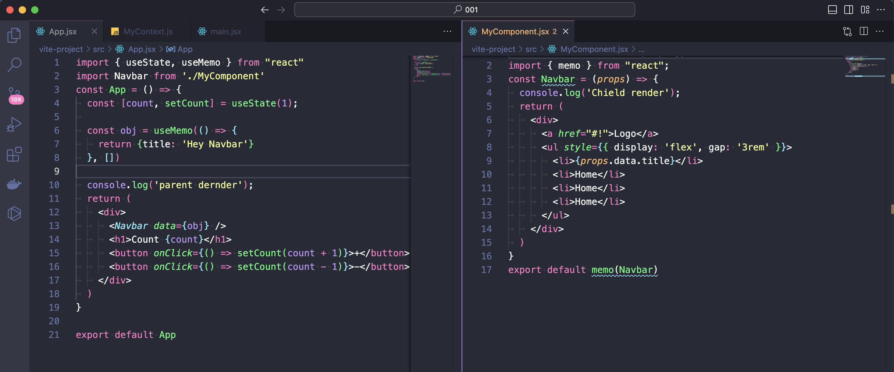

# 📔 9-dars

## Funktsiya komponentlar haqida
ReactJS-da funktsional komponentlar React ilovalarida ishlatiladigan asosiy komponentlardir. Funktsional komponentlar React sinfi komponentlariga muqobil sifatida ishlab chiqilgan va odatda sodda va o'qilishi mumkin bo'lgan sintaksisni taklif qiladi.

Funktsional komponent funksiya sifatida aniqlanadi va JSX ni qaytaradi. Funktsiya komponentning xususiyatlarini (rekvizitlarini) oladi va UI yaratish uchun ushbu xususiyatlardan foydalanadi. Funktsional komponentlarni React Hooks yordamida boshqarishi mumkin.

Quyida namunaviy funktsional komponentni qanday yaratishni ko'rsatadigan misol keltirilgan:

```js
import React from 'react';

const ExampleComponent = (props) => {
  return (
    <div>
      <h1>{props.title}</h1>
      <p>{props.content}</p>
    </div>
  );
}

export default ExampleComponent;
```

## ReactJS Hooks to'liq. useState, useEffect, useRef va useMemo

### useState() nima?
useState - bu React Hook bo'lib, u funktsional komponentga holat qo'shish imkonini beradi. U ikkita qiymatga ega massivni qaytaradi: joriy holat va uni yangilash funksiyasi. Hook argument sifatida boshlang'ich holat qiymatini oladi va sozlash funktsiyasi chaqirilganda yangilangan holat qiymatini qaytaradi.


```js
import { useState } from 'react';

export default function Counter() {
  const [count, setCount] = useState(0);

  function handleClick() {
    setCount(count + 1);
  }

  return (
    <button onClick={handleClick}>
      You pressed me {count} times
    </button>
  );
}
```

### Amaliyot useState hooki yordamida to'iq functionlaga ega counter yasash, Va useStateni formlarda(input, texarea...) sinab ko'rish

## Fuktsional komponentlarda yordamida life cycle(hayot tsikili) tushunchasi,
Misol: <br />


### ComponentDidMount, ComponentDidUpdate, ComponentDidWillUnmount, functional componentlarda qanday ishlaydi. useEffect();

useEffectikkita argumentni qabul qiladi. Ikkinchi argument ixtiyoriydir.
```text
useEffect(<function>, <dependency>)
```
Msiol:

```js
// Every rerender
useEffect(() => {
	console.log("I run everytime this component rerenders")
});

// onMount
useEffect(() => {
	console.log("I Only run once (When the component gets mounted)")
}, []);

// Condition based 
useEffect(() => {
	console.log("I run everytime my condition is changed")
}, [condition]);

// Condition based with "clean up"
useEffect(() => {
	console.log("I run everytime my condition is changed")
	
	return () => {
    	console.log("Use this return as a 'clean up tool' (this runs before the actual code)")
    }
}, [condition]);
```

Msiol:

```js
import { useState, useEffect } from "react";

function Timer() {
  const [count, setCount] = useState(0);

  useEffect(() => {
    setTimeout(() => {
      setCount((count) => count + 1);
    }, 1000);
  });

  return <h1>I've rendered {count} times!</h1>;
}
```
Lekin kuting!! U faqat bir marta hisoblashi kerak bo'lsa ham, hisoblashda davom etadi!

useEffecthar bir renderda ishlaydi. Bu shuni anglatadiki, hisoblash o'zgarganda, render sodir bo'ladi va bu boshqa effektni ishga tushiradi.

Bu biz xohlagan narsa emas. Yon ta'sirlar paydo bo'lganda nazorat qilishning bir necha yo'li mavjud.

Biz har doim massivni qabul qiladigan ikkinchi parametrni kiritishimiz kerak. useEffectBiz ixtiyoriy ravishda ushbu massivga bog'liqliklarni o'tkazishimiz mumkin .

```js
import { useState, useEffect } from "react";

function Timer() {
  const [count, setCount] = useState(0);

  useEffect(() => {
    setTimeout(() => {
      setCount((count) => count + 1);
    }, 1000);
  }, []); // <- add empty brackets here

  return <h1>I've rendered {count} times!</h1>;
}
```

## Funktsional komponentda reflardan fotdalanish useRef()

useRef() o'zgaruvchan ref objectini qaytaradi ya'ni bizga obeject qaytarad va bu objectni ichida hossa bo'ladi current uning joriy hususiyati o'tgan argument bilan ishga tushurilinadi ya'ni initial value boshlang'ich ma'lumot bilan ishga tushirilinadi qaytgan object componentda har doim saqlanib qolinadi

Misol:

```js
import React, { useRef } from 'react';

const ExampleComponent = () => {
  const inputRef = useRef(null);

  const handleClick = () => {
    inputRef.current.focus();
  };

  return (
    <div>
      <input ref={inputRef} type="text" />
      <button onClick={handleClick}>Odaklan</button>
    </div>
  );
}

export default ExampleComponent;
```

## useMemo();
React-da kodlash bo'yicha ko'proq malakaga ega bo'lganingiz sayin, ishlash sizning rivojlanish jarayoningizda asosiy markazga aylanadi.

Har qanday vosita yoki dasturlash metodologiyasida bo'lgani kabi, keshlash React ilovalarini optimallashtirishda katta rol o'ynaydi.

React-da keshlash odatda memoizatsiya atamasi bilan amalga oshiriladi . U komponentning holat yoki prop mutatsiyalari tufayli ko'rsatish vaqtini kamaytirish orqali ishlashni yaxshilash uchun ishlatiladi.

React keshlash uchun ikkita API taqdim etadi: useMemo va useCallback. useCallback funksiyani xotirada saqlaydigan ilgak, useMemo esa qiymatni xotirada saqlaydigan ilgakdir. Ushbu ikkita ilgak ko'pincha samaradorlikni oshirish uchun Context API bilan birgalikda ishlatiladi.

Mana, biz ushbu maqolada ko'rib chiqiladigan mavzularning asosiy ro'yxati

Misol:

Bu yerda odiy example biz holi hech qanday useMemo ishlatmadi shu codelarni o'zingizda yozing va natijasini consoleda ko'ring albatda inc, decr tugmachalarini ishlatib

Ikkinchi misol:


``Hulosa qachon memo ishlatilinadi agarda componentlarimizda useState bo'lsa va bir componentni ichida chield sifatida boshqa component chaqirilsa va o'sha yerda useState bo'lsa memo ishlatilinadi!``

Agarda biz navbar komponentimizga biror qiymat yuborsak props yordamida ``<Navbar title="Hy Navbar" />`` bundaham bizda faqat parent render bo'ladi lekin agar biz ``<Navbar obj={{title: "Hy Navbar"}} />`` deb object yuborsak unda parentham chieldham render bo'ladi buni oldini qanday olmai? 

Misol:


## useCallback()

useCallbackni nima farqi bor useMemodan keling ko'rib chiqamiz ikkalasi deyarli bir hil ishlaydi

```js
const obj1 = useMemo(() => {
	return {title: 'Hey Navbar'}
}, [])

const obj2 = useCallback(() => {
	return { title: 'Hey Navbar' }
}, [])
console.log(typeof obj1); // object
console.log(typeof obj2); // function
```
Bizda obj1 object qaytaradi obj2 esa function qaytaradi bu nima degani biz useCallback yordamida componentga props sifatida biror ma'lumot yuborish imkonini beradi

Misol: 


### Xulosa useMemo valuega returin qilar ekan useCallback esa functionnga returin qilar ekan
